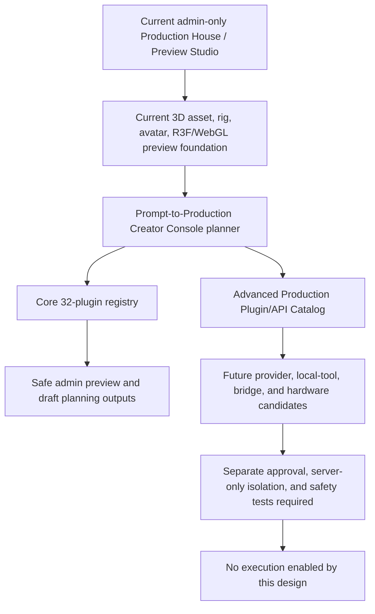
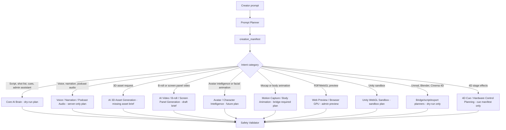
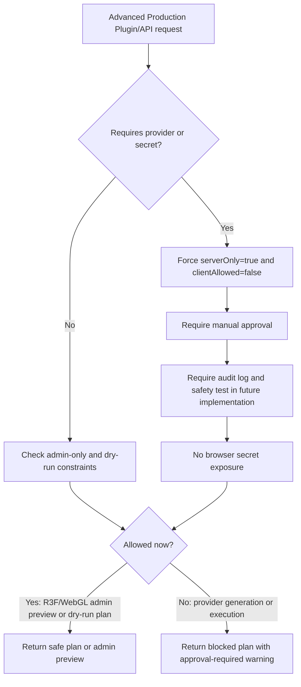
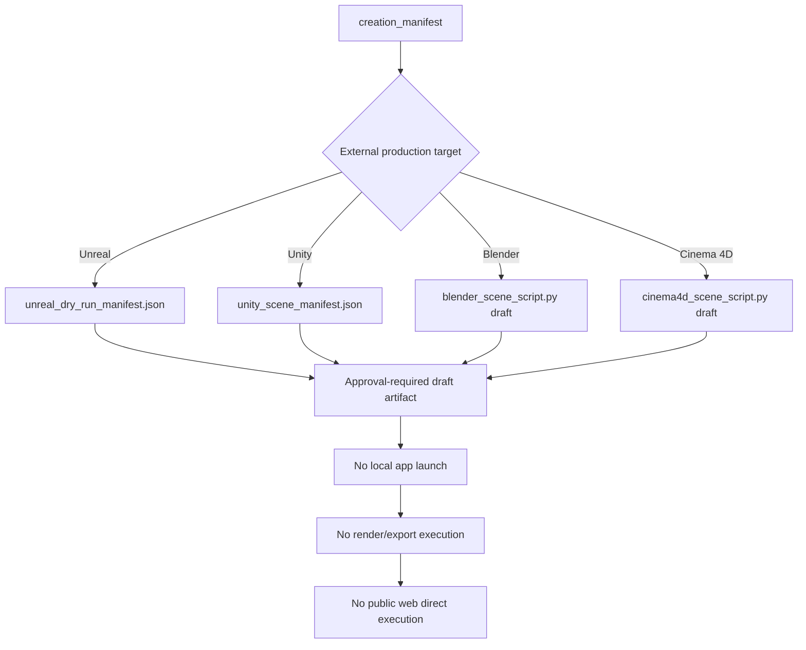
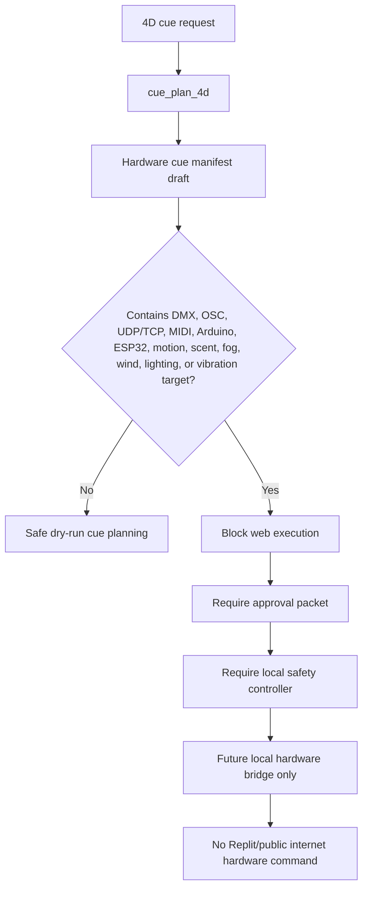
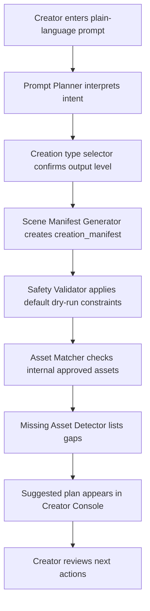
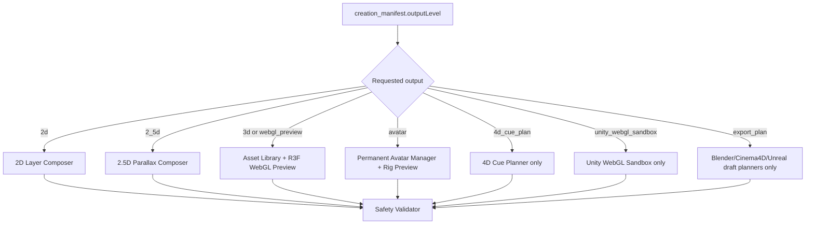
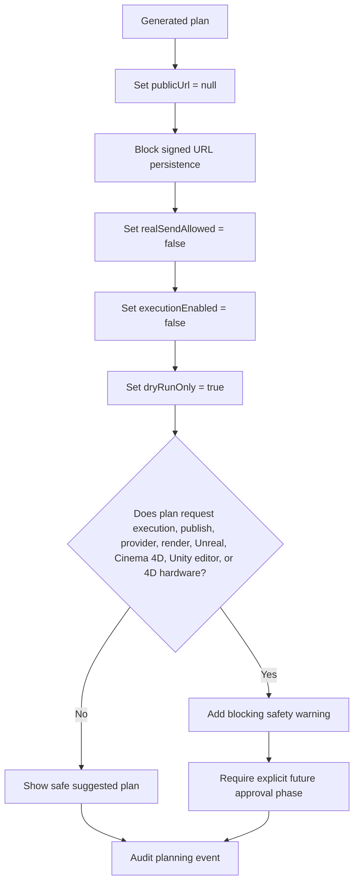
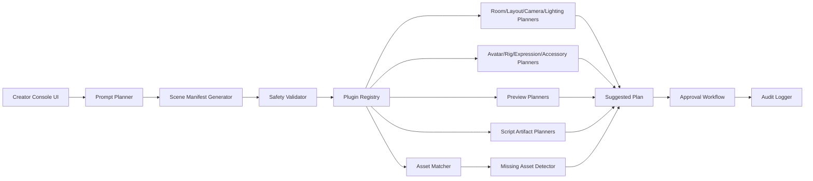
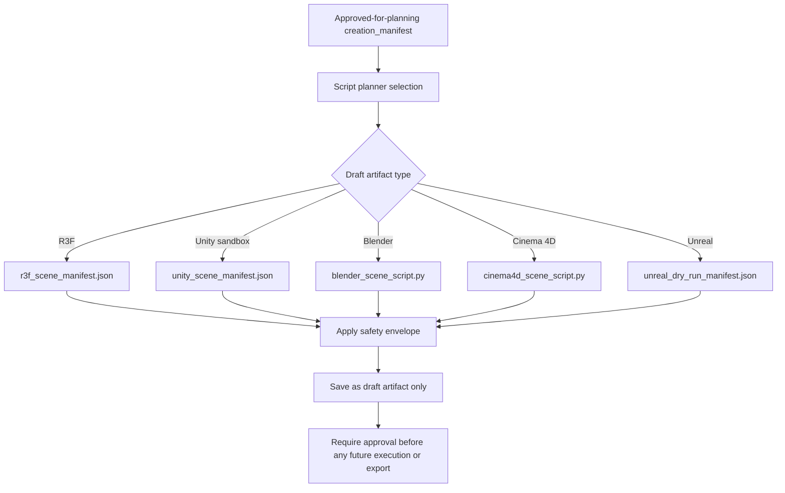

# Prompt-to-Production Creator Console Design

Status: design only

Owner surface: Mougle Production House admin

Proposed route: `/admin/production-house/creator-console`

This document defines a safe, creator-friendly design for a Mougle Prompt-to-Production Creator Console. It does not authorize implementation, schema changes, route changes, rendering, publishing, provider calls, Unity execution, Unreal execution, Cinema 4D execution, Blender execution, 4D hardware commands, or public asset exposure.

## Source Scan

### Screenshots

The Production House screenshot shows an admin-only preview studio with an existing dark operations layout, safe-mode badges, preview modes, room/stage metadata, avatar and panel summaries, camera and lighting selectors, overlay toggles, 4D cue markers, archive controls, dashboard metrics, and API integration status. The strongest design signals are:

- Preserve the admin-only preview posture.
- Keep safety status visible above creative controls.
- Treat room, avatar, panel, cue, camera, and lighting decisions as inspectable plan data.
- Keep `publicUrl` and `signedUrl` empty, `realSendAllowed` false, and `executionEnabled` false by default.
- Separate preview planning from render, publish, provider, Unreal, Unity, and hardware execution.

The dashboard screenshot shows the broader Mougle admin map: Founder Control, Command Center, Digital World, Safety and Governance, Agents and Civilization, Knowledge and Truth, media pipelines, room studios, ProductionHouse, 3D/4D/Unreal, distribution, marketplace, and operations. The key design signal is that the Creator Console should be one calm front door into this large system, not another expert-only dashboard.

### Docs

This design uses the following existing Mougle references:

- `docs/library/INDEX.md`
- `docs/archive/ARCHIVE_LIBRARY_INDEX.md`
- `docs/design/R7B_PERMANENT_AVATAR_ENTITY_DESIGN.md`
- `docs/runbooks/PERMANENT_3D_AVATAR_CREATION_RUNBOOK.md`
- `docs/reports/R7A_AVATAR_RIG_VISUAL_PREVIEW_AUDIT.md`
- `docs/reports/R3F_WEBGL_UNITY_PRODUCTION_HOUSE_INTEGRATION_R1_DESIGN.md`
- `docs/reports/R3F_PREVIEW_SANDBOX_R3_REPORT.md`
- `docs/reports/R3F_STATIC_GLB_DEMO_LOADER_R5B_REPORT.md`
- `docs/library/external-references/R3F_OFFICIAL_REFERENCES.md`

Important inherited guardrails:

- Mougle uses private/admin-only asset workflows.
- Signed preview URLs are ephemeral and must not be persisted.
- R3F/WebGL preview surfaces are admin-only and lazy-loaded.
- Permanent avatar entities bind approved internal assets and rigs, not public assets.
- Unity WebGL, Unreal, Blender, Cinema 4D, render jobs, provider jobs, and 4D hardware remain dry-run or approval-gated planning surfaces until separately approved.

## Production House Capability Map

The Creator Console should sit above existing Mougle Production House surfaces without blurring what is safe today and what is only a future external or bridge plan. This map is the boundary contract for the design.

| Layer | Capability state | What the creator sees | What Mougle can safely do now | Future or bridge boundary | Safety line |
|---|---|---|---|---|---|
| 1. Current admin-only Production House / Preview Studio | Current safe admin capability | Production dashboard, preview studio, room presets, panel summaries, 4D cue markers, history/admin controls, mock/safe badges | Display admin-only planning and preview state. Preserve not-rendered, not-published, no-Unreal, no-4D-hardware posture | Future work may route Creator Console plans into this surface after approval | No public publishing, no render execution, no real send, no hardware command |
| 2. Current 3D asset, rig, and avatar preview foundation | Current safe admin foundation | 3D asset library, GLB/GLTF preview paths, avatar rig preview, R3F/WebGL sandbox, virtual set preview | Inspect approved internal assets and rigs, preview safe GLB/GLTF scenes in admin-only browser surfaces | Future work may improve matching, scene assembly, and avatar-room composition | Approved internal assets only; signed URLs ephemeral and never persisted |
| 3. Permanent avatar gaps and future phases | Mixed: core foundation exists, richer production behavior is future | Permanent avatar selection plus future expression, accessory, pose, room, and animation planning | Use approved permanent avatar and rig data where available | Expression library, accessory library, pose/clip library, room assignment choreography, and behavior engines need separate approved phases | Do not add columns, tables, schemas, or routes from this design task |
| 4. Mougle Studio Pro as local controller / future bridge shell | Future bridge shell only | A possible local operator/controller layer for advanced studios | Nothing in P2P-1 | Future local controller may coordinate approved draft artifacts with installed creative tools or hardware bridges | No local command execution, no sockets, no render trigger, no hardware trigger from this design |
| 5. Prompt-to-Production Creator Console | Design-only P2P-1 | One prompt box, creation type selector, suggested plan, plugins, missing assets, safety warnings, preview panel, approval status | Produce documented design intent only | Later phases may add a static shell, registry, manual manifest stub, then safe preview integration | No source behavior change until separately approved |
| 6. Advanced Production Plugin/API Catalog | Future catalog only | Human-readable list of advanced possible providers, bridges, and production tools | Name future capabilities as disabled, planned, or dry-run references | Provider/API calls, bridge commands, distribution, and uploads require server-only design, approvals, and separate PRs | No provider call from browser; no secret storage in draft artifacts |
| 7. 4D cue planning vs real 4D hardware execution | Current planning may exist; real hardware is out of scope | Cue timeline, screen changes, virtual light states, camera move plans | Draft 4D cue plans and preview markers only | Spyder, Barco, Novastar, show-control, and physical venue systems are future external hardware integrations | No physical 4D command, no hardware packet, no live runner |
| 8. Cinema 4D / Blender / Unreal as draft script/export planners only | Dry-run planning only | Draft artifact names and review notes for external production tools | Generate or describe draft plan artifacts only in future approved phases | Real script execution, export, render, remote Unreal, and tool automation require separate approvals | Never execute Blender, Cinema 4D, Unity, Unreal, shell, provider, render, or publishing actions from Creator Console |

Capability separation rules:

- Current Mougle admin surfaces are the safe baseline.
- The Creator Console is a planner and coordinator, not an execution engine.
- Advanced providers, local creative tools, and hardware bridges belong in the external catalog until a later approved phase promotes one capability.
- Any promoted capability must keep the existing safety defaults unless a single action receives explicit approval in a future task.

## Creator Experience

The Creator Console should let a non-expert human creator describe an outcome in plain language. The creator should not need to understand R3F, WebGL, WebGPU, Unity, Blender, Cinema 4D, Unreal, schemas, APIs, validators, storage, signed URLs, private buckets, or approval internals.

Primary prompt:

```text
Describe what you want to create.
```

Example prompts:

- Create a cinematic blue-glass newsroom with two avatars and a center screen wall.
- Create a warm podcast room with two hosts, microphones, table props, and city-window background.
- Create a debate room with moderator center desk, two guest sides, fact-check panel, and serious lighting.
- Create a living room/avatar lounge with four permanent avatars and casual conversation setup.
- Create avatar expressions: neutral, smiling, serious, skeptical, surprised.
- Create a 2.5D intro scene with parallax city background and animated lower-third.
- Create a 4D cue plan for screen changes, virtual lights, and camera moves only.

Creator-facing output should be a suggested plan with friendly labels:

- What Mougle thinks the creator wants.
- Which room, avatar, media, cue, and preview pieces are needed.
- Which assets already exist.
- Which assets are missing.
- Which plugins would be used.
- Which steps are safe to preview now.
- Which steps require approval later.

Expert implementation details should stay collapsed by default.

## Creation Manifest Output

Every prompt should produce a structured `creation_manifest` JSON object before any tool-specific planning occurs. The manifest is the contract between the plain-language prompt and Mougle's internal planning surfaces.

```json
{
  "projectType": "production_scene",
  "roomType": "news_room",
  "outputLevel": "webgl_preview",
  "style": {
    "label": "cinematic blue-glass newsroom",
    "visualReferences": [],
    "colorPalette": ["blue", "glass", "white accent"],
    "era": "modern"
  },
  "mood": {
    "primary": "serious",
    "secondary": "polished",
    "energy": "calm"
  },
  "avatarsNeeded": [
    {
      "role": "anchor",
      "count": 1,
      "permanentAvatarRequired": true,
      "rigRequired": true,
      "expressionSet": ["neutral", "serious", "smiling"]
    },
    {
      "role": "co_anchor",
      "count": 1,
      "permanentAvatarRequired": true,
      "rigRequired": true,
      "expressionSet": ["neutral", "skeptical"]
    }
  ],
  "assetRequirements": [
    {
      "type": "room_model",
      "label": "blue-glass newsroom",
      "format": "glb",
      "approvalState": "approved_internal_required"
    },
    {
      "type": "prop",
      "label": "center screen wall",
      "format": "glb_or_panel_manifest",
      "approvalState": "approved_internal_required"
    }
  ],
  "roomRequirements": {
    "layout": "anchor_left_panel_right",
    "zones": ["desk", "screen_wall", "topic_panel", "camera_lane"],
    "defaultRoom": "news_room"
  },
  "accessories": [
    {
      "label": "anchor desk microphone",
      "target": "anchor",
      "approvalState": "planned"
    }
  ],
  "expressions": ["neutral", "smiling", "serious", "skeptical", "surprised"],
  "screenPanels": [
    {
      "label": "center screen wall",
      "contentType": "draft_graphics",
      "safePreviewOnly": true
    }
  ],
  "lowerThirds": [
    {
      "label": "Mougle Intelligence Network",
      "motion": "slide_in",
      "safePreviewOnly": true
    }
  ],
  "lightingPlan": {
    "preset": "neutral_news",
    "notes": "Cool studio key light with soft panel glow.",
    "hardwareCommandsAllowed": false
  },
  "cameraPlan": {
    "preset": "anchor_two_shot",
    "moves": [
      {
        "label": "open on wide newsroom",
        "type": "virtual_camera_only",
        "durationSeconds": 4
      }
    ]
  },
  "voiceNeeds": [
    {
      "role": "anchor",
      "needsVoiceJob": true,
      "providerCallAllowed": false,
      "approvalRequired": true
    }
  ],
  "aiJobsNeeded": [
    {
      "jobType": "draft_scene_plan",
      "providerCallAllowed": false,
      "approvalRequired": true
    }
  ],
  "renderPlan": {
    "previewType": "r3f_webgl_admin_preview",
    "renderExecutionAllowed": false,
    "highEndExportPlanOnly": true
  },
  "safetyConstraints": {
    "publicUrl": null,
    "signedUrlPersistenceAllowed": false,
    "realSendAllowed": false,
    "executionEnabled": false,
    "approvalRequired": true,
    "dryRunOnly": true,
    "providerCallFromBrowserAllowed": false,
    "publicPublishingAllowed": false,
    "renderExecutionAllowed": false,
    "liveRunnerAllowed": false,
    "unrealExecutionAllowed": false,
    "cinema4dExecutionAllowed": false,
    "unityExecutionOutsideSandboxAllowed": false,
    "hardware4dCommandAllowed": false,
    "spyderBarcoNovastarCommandAllowed": false
  },
  "approvalRequired": true,
  "missingAssets": [
    {
      "label": "blue-glass newsroom room model",
      "type": "room_model",
      "recommendedAction": "request_internal_asset_or_plan_draft_artifact"
    }
  ],
  "recommendedPlugins": [
    "prompt_planner",
    "scene_manifest_generator",
    "safety_validator",
    "asset_matcher",
    "missing_asset_detector",
    "r3f_webgl_preview"
  ],
  "nextActions": [
    {
      "label": "Review suggested manifest",
      "requiresApproval": false
    },
    {
      "label": "Match internal assets",
      "requiresApproval": false
    },
    {
      "label": "Request approval for draft script artifacts",
      "requiresApproval": true
    }
  ]
}
```

Allowed `outputLevel` values:

- `2d`
- `2_5d`
- `3d`
- `4d_cue_plan`
- `webgl_preview`
- `webgpu_future`
- `unity_webgl_sandbox`
- `export_plan`

## Plugin Registry Schema

The Creator Console should use a static plugin registry first. The registry is a planner map, not an execution engine.

```json
{
  "pluginId": "r3f_webgl_preview",
  "label": "R3F WebGL Preview Plugin",
  "category": "preview",
  "creatorFriendlyDescription": "Shows a safe admin-only browser preview of an approved scene plan.",
  "internalTool": "R3F preview sandbox",
  "currentRoute": "/admin/r3f-preview-sandbox",
  "inputTypes": ["creation_manifest", "r3f_scene_manifest"],
  "outputTypes": ["admin_preview_state"],
  "requiresProvider": false,
  "providerName": null,
  "serverOnly": false,
  "clientAllowed": true,
  "approvalRequired": true,
  "dryRunOnly": true,
  "enabled": true,
  "status": "active",
  "safetyNotes": "Admin-only preview. No public URL, no provider calls, no render execution.",
  "docsLink": "docs/reports/R3F_PREVIEW_SANDBOX_R3_REPORT.md"
}
```

Status values:

- `active`: Existing Mougle admin surface or existing documented internal capability.
- `planned`: Design target that needs future implementation.
- `dry_run`: Planner may produce a draft plan, but no execution is allowed.
- `disabled`: Known unsafe or unavailable capability.
- `compatibility_alias`: Friendly name that maps to an existing internal route or tool.

## Required Plugin Registry

| pluginId | Label | Category | Creator-friendly description | Internal tool | Current route | Input types | Output types | Requires provider | Provider | Server only | Client allowed | Approval required | Dry run only | Enabled | Status | Safety notes | Docs link |
|---|---|---|---|---|---|---|---|---|---|---|---|---|---|---|---|---|---|
| `prompt_planner` | Prompt Planner Plugin | planning | Turns plain language into a creator-safe plan. | Prompt planner | `/admin/production-house/creator-console` | `prompt_text` | `planner_intent` | false | null | true | false | true | true | true | planned | Planning only. No provider call from browser. | This document |
| `scene_manifest_generator` | Scene Manifest Generator | planning | Converts the plan into structured manifest JSON. | Manifest generator | `/admin/production-house/creator-console` | `planner_intent` | `creation_manifest` | false | null | true | false | true | true | true | planned | Produces draft manifest only. | This document |
| `safety_validator` | Safety Validator Plugin | safety | Checks that every plan stays private, dry-run, and approval-gated. | Safety validator | `/admin/production-house/creator-console` | `creation_manifest` | `safety_report` | false | null | true | false | true | true | true | planned | Must block public publishing, execution, and provider calls. | `docs/runbooks/PERMANENT_3D_AVATAR_CREATION_RUNBOOK.md` |
| `asset_matcher` | Asset Matcher Plugin | assets | Finds existing internal assets that match the prompt. | Asset matcher | `/admin/3d-assets` | `creation_manifest` | `asset_matches` | false | null | true | false | true | true | true | planned | Internal approved assets only. | `docs/runbooks/PERMANENT_3D_AVATAR_CREATION_RUNBOOK.md` |
| `missing_asset_detector` | Missing Asset Detector | assets | Lists assets Mougle does not have yet. | Missing asset detector | `/admin/production-house/creator-console` | `creation_manifest`, `asset_matches` | `missing_assets` | false | null | true | false | true | true | true | planned | No auto-generation or upload. | This document |
| `r3f_webgl_preview` | R3F WebGL Preview Plugin | preview | Shows a safe admin-only browser preview of an approved scene plan. | R3F preview sandbox | `/admin/r3f-preview-sandbox` | `creation_manifest`, `r3f_scene_manifest` | `admin_preview_state` | false | null | false | true | true | true | true | active | Admin-only preview. No public URL, no provider calls, no render execution. | `docs/reports/R3F_PREVIEW_SANDBOX_R3_REPORT.md` |
| `webgpu_future_preview` | WebGPU Future Preview Plugin | preview | Reserves a future path for higher-performance browser previews. | Future WebGPU preview | null | `creation_manifest` | `webgpu_preview_plan` | false | null | false | false | true | true | false | planned | Future only. Must not become required for V1.1. | This document |
| `glb_gltf_loader` | GLB/GLTF Loader Plugin | assets | Loads approved internal GLB or GLTF assets for preview. | GLB/GLTF loader | `/admin/r3f-preview-sandbox` | `approved_internal_asset`, `r3f_scene_manifest` | `preview_model` | false | null | false | true | true | true | true | active | Internal assets only. No external image URIs. | `docs/reports/R3F_STATIC_GLB_DEMO_LOADER_R5B_REPORT.md` |
| `asset_library_3d` | 3D Asset Library Plugin | assets | Lets admins inspect internal room, prop, and model assets. | Production asset library | `/admin/3d-assets` | `asset_query` | `asset_inventory` | false | null | true | false | true | true | true | active | Private storage. Approved internal assets only. | `docs/runbooks/PERMANENT_3D_AVATAR_CREATION_RUNBOOK.md` |
| `permanent_avatar_manager` | Permanent Avatar Manager Plugin | avatars | Selects permanent avatars for rooms and productions. | Permanent avatar manager | `/admin/permanent-avatars` | `avatar_request` | `avatar_selection_plan` | false | null | true | false | true | true | true | active | Permanent avatars must bind approved internal body and rig assets. | `docs/design/R7B_PERMANENT_AVATAR_ENTITY_DESIGN.md` |
| `avatar_rig_preview` | Avatar Rig Preview Plugin | avatars | Previews rig posture and metadata for internal avatar assets. | Avatar rig preview | `/admin/avatar-rig-preview` | `approved_rig_asset` | `rig_preview_state` | false | null | false | true | true | true | true | active | T-pose/A-pose preview only. No animation generation. | `docs/reports/R7A_AVATAR_RIG_VISUAL_PREVIEW_AUDIT.md` |
| `avatar_expression_planner` | Avatar Expression Planner | avatars | Plans neutral, smiling, serious, skeptical, surprised, and future expression sets. | Expression planner | `/admin/production-house/creator-console` | `avatar_request`, `creation_manifest` | `expression_plan` | false | null | true | false | true | true | true | planned | Plan only until expression library is approved. | `docs/reports/R7A_AVATAR_RIG_VISUAL_PREVIEW_AUDIT.md` |
| `avatar_accessory_planner` | Avatar Accessory Planner | avatars | Plans microphones, glasses, clothing, handheld props, and room-specific accessories. | Accessory planner | `/admin/production-house/creator-console` | `avatar_request`, `creation_manifest` | `accessory_plan` | false | null | true | false | true | true | true | planned | Plan only until accessory library is approved. | `docs/design/R7B_PERMANENT_AVATAR_ENTITY_DESIGN.md` |
| `room_layout_planner` | Room Layout Planner | rooms | Converts the creator's room idea into zones and layout presets. | Room layout planner | `/admin/production-house/creator-console` | `creation_manifest` | `room_layout_plan` | false | null | true | false | true | true | true | planned | No schema or route changes in P2P-1. | This document |
| `virtual_set_preview` | Virtual Set Preview Plugin | rooms | Shows an admin-only preview of a virtual room or stage. | Virtual set preview | `/admin/virtual-set-preview` | `room_layout_plan`, `r3f_scene_manifest` | `virtual_set_preview_state` | false | null | false | true | true | true | true | active | Preview only. No render/export/publish. | `docs/reports/R3F_WEBGL_UNITY_PRODUCTION_HOUSE_INTEGRATION_R1_DESIGN.md` |
| `layer_composer_2d` | 2D Layer Composer | composition | Plans flat images, overlays, title cards, lower thirds, and still panels. | 2D layer composer | `/admin/production-house/creator-console` | `creation_manifest` | `layer_plan_2d` | false | null | true | false | true | true | true | planned | Draft layer plans only. | This document |
| `parallax_composer_2_5d` | 2.5D Parallax Composer | composition | Plans layered parallax intros, background depth, and safe camera motion. | 2.5D parallax composer | `/admin/production-house/creator-console` | `creation_manifest`, `layer_plan_2d` | `parallax_plan` | false | null | true | false | true | true | true | planned | No render execution. | This document |
| `screen_wall_designer` | Screen Wall Designer | panels | Plans studio screen walls and topic panels. | Screen wall designer | `/admin/production-house/creator-console` | `creation_manifest` | `screen_panel_plan` | false | null | true | false | true | true | true | planned | Draft screen content only. | This document |
| `lower_third_designer` | Lower Third Designer | panels | Plans lower-third overlays and ticker style. | Lower third designer | `/admin/production-house/creator-console` | `creation_manifest` | `lower_third_plan` | false | null | true | false | true | true | true | planned | Draft graphics only. | This document |
| `lighting_planner` | Lighting Planner | cinematics | Plans virtual light presets and mood. | Lighting planner | `/admin/production-house/creator-console` | `creation_manifest` | `lighting_plan` | false | null | true | false | true | true | true | planned | Virtual lights only. No hardware command. | This document |
| `camera_planner` | Camera Planner | cinematics | Plans virtual camera angles and movement cues. | Camera planner | `/admin/production-house/creator-console` | `creation_manifest` | `camera_plan` | false | null | true | false | true | true | true | planned | Virtual camera only. | This document |
| `cue_planner_4d` | 4D Cue Planner | 4d | Plans screen changes, virtual light states, and camera cues without hardware execution. | 4D cue planner | `/admin/4d-cue-timeline` | `creation_manifest`, `camera_plan`, `lighting_plan` | `cue_plan_4d` | false | null | true | false | true | true | true | dry_run | No Spyder, Barco, Novastar, or physical 4D command. | `docs/archive/ARCHIVE_LIBRARY_INDEX.md` |
| `voice_jobs_planner` | Voice Jobs Planner | voice | Plans voice needs and approval steps. | Voice job planner | `/admin/voice-studio` | `creation_manifest` | `voice_job_plan` | true | configurable | true | false | true | true | true | dry_run | No provider call from browser. No real send. | `docs/archive/ARCHIVE_LIBRARY_INDEX.md` |
| `ai_jobs_planner` | AI Jobs Planner | ai | Plans AI work needed for copy, scene logic, assets, or analysis. | AI job planner | `/admin/ai-jobs` | `creation_manifest` | `ai_job_plan` | true | configurable | true | false | true | true | true | dry_run | Draft jobs only until approved. | `docs/archive/ARCHIVE_LIBRARY_INDEX.md` |
| `ai_worker_capacity_checker` | AI Worker Capacity Checker | ai | Checks whether workers are available before suggesting AI work. | Worker capacity checker | `/admin/production-house` | `ai_job_plan` | `capacity_report` | false | null | true | false | true | true | true | planned | Informational only. No worker dispatch. | This document |
| `build_readiness_checker` | Build Readiness Checker | readiness | Shows whether a plan is ready for safe preview, draft artifacts, or approval. | Readiness checker | `/admin/production-house` | `creation_manifest`, `safety_report`, `missing_assets` | `readiness_report` | false | null | true | false | true | true | true | planned | Blocks execution until explicit future approval flow. | This document |
| `unity_webgl_sandbox` | Unity WebGL Sandbox Plugin | unity | Plans or displays a sandboxed Unity WebGL preview when a safe build already exists. | Unity WebGL sandbox | `/admin/unity-webgl-sandbox` | `unity_scene_manifest` | `sandbox_preview_plan` | false | null | false | true | true | true | true | active | Sandbox only. No Unity editor or build execution. | `docs/reports/R3F_WEBGL_UNITY_PRODUCTION_HOUSE_INTEGRATION_R1_DESIGN.md` |
| `blender_script_planner` | Blender Python Script Planner | export | Drafts a Blender scene script artifact for later human review. | Blender script planner | `/admin/production-house/creator-console` | `creation_manifest` | `blender_scene_script.py` | false | null | true | false | true | true | true | dry_run | Generate draft artifact only. Never execute. | This document |
| `cinema4d_script_planner` | Cinema 4D Python Script Planner | export | Drafts a Cinema 4D scene script artifact for later human review. | Cinema 4D script planner | `/admin/production-house/creator-console` | `creation_manifest` | `cinema4d_scene_script.py` | false | null | true | false | true | true | true | dry_run | Generate draft artifact only. Never execute. | This document |
| `unreal_export_planner` | Unreal Export Planner | export | Drafts an Unreal dry-run export manifest for later review. | Unreal export planner | `/admin/unreal-sandbox-bridge` | `creation_manifest` | `unreal_dry_run_manifest.json` | false | null | true | false | true | true | true | dry_run | No Unreal execution or remote command. | `docs/archive/ARCHIVE_LIBRARY_INDEX.md` |
| `approval_workflow` | Approval Workflow Plugin | approvals | Routes risky next steps to admin approval before anything can run. | Approval workflow | `/admin/production-house` | `readiness_report`, `draft_artifacts` | `approval_request` | false | null | true | false | true | true | true | planned | Approval is required before execution/export/publish in future phases. | This document |
| `audit_logger` | Audit Logger Plugin | audit | Records who planned, reviewed, approved, or rejected a creator plan. | Audit logger | `/admin/audit-logs` | `creator_console_event` | `audit_log_event` | false | null | true | false | true | true | true | active | Log metadata only. Never log secrets or signed URLs. | `docs/archive/ARCHIVE_LIBRARY_INDEX.md` |

## Advanced Production Plugin/API Catalog

This section preserves the earlier Advanced External Plugin/API Catalog idea, but renames it for the production-tool audit and gives every catalog entry the required fields. The catalog is separate from the core 32-plugin registry above. The core registry describes the Creator Console's internal planning plugins. This catalog names high-risk future provider, bridge, local-tool, browser-GPU, distribution, and hardware surfaces so they can stay visibly separated from current safe Mougle capabilities.

Catalog rules:

- Catalog entries are not enabled integrations.
- Catalog entries must default to `dry_run`, `planned`, `future`, `external_bridge_required`, or `disabled` unless the capability is already a safe admin-only preview.
- Catalog entries must never expose credentials, tokens, signed URLs, private bucket paths, webhook secrets, or provider keys.
- Provider-backed entries must be server-side only and manually approved.
- A catalog entry can become executable only through a separate approved implementation phase with server-only isolation, audit logging, approval gates, and safety tests.

| pluginId | displayName | category | creatorFriendlyDescription | technicalTool | providerRequired | secretRequired | serverOnly | clientAllowed | dryRunOnly | approvalRequired | currentStatus | inputTypes | outputTypes | safetyNotes | docsLink |
|---|---|---|---|---|---|---|---|---|---|---|---|---|---|---|---|
| `core_ai_brain` | Core AI Brain | ai_planning | Helps plan scripts, scenes, shots, cues, manifests, and admin guidance. | OpenAI API / GPT-5.5 Pro planner; Codex / Replit Agent build assistant; Replit Secrets manager | true | true | true | false | true | true | dry_run | `prompt_text`, `creation_manifest`, `admin_context` | `script_brief`, `shot_list`, `cue_plan`, `prompt_to_manifest_plan`, `admin_assistant_response` | Server-side only. Replit Secrets manager stores secrets; the browser never receives secrets or provider tokens. No autonomous build or provider call from this design. | This document |
| `voice_narration_podcast_audio` | Voice / Narration / Podcast Audio | voice_audio | Plans anchor voices, podcast host voices, guest voices, narration, STT/TTS, and mock fallback review. | ElevenLabs API; ElevenLabs TTS; OpenAI audio / speech models | true | true | true | false | true | true | dry_run | `voice_needs`, `script_brief`, `speaker_roles` | `voice_job_plan`, `tts_plan`, `stt_plan`, `mock_voice_review_plan` | Server-side only, manual approval, no browser secret exposure, no voice generation until separately approved. | This document |
| `ai_3d_asset_generation` | AI 3D Asset Generation | asset_generation | Plans draft props, screens, room elements, and other 3D assets from text or image references. | Meshy API; Meshy Text-to-3D; Meshy Image-to-3D | true | true | true | false | true | true | planned | `asset_requirements`, `image_reference_metadata`, `room_requirements` | `asset_generation_plan`, `draft_asset_brief`, `missing_asset_request` | Generated assets must pass GLB/GLTF validation, license review, safety review, and `approved_internal` before use. No auto-generation in this design. | `docs/runbooks/PERMANENT_3D_AVATAR_CREATION_RUNBOOK.md` |
| `ai_video_broll_screen_panels` | AI Video / B-roll / Screen Panel Generation | video_generation | Plans B-roll, animated inserts, screen-wall video panels, explainers, and transitions. | Runway API; Runway Gen video API | true | true | true | false | true | true | planned | `screen_panels`, `storyboard_notes`, `transition_request` | `video_job_plan`, `screen_panel_video_plan`, `transition_plan` | Draft/reference only until approved. No autonomous publishing, render execution, or provider call from browser. | This document |
| `avatar_character_intelligence` | Avatar / Character Intelligence | avatars | Plans conversational avatars, digital human animation, facial animation, and realistic anchors or hosts. | Convai; NVIDIA ACE; NVIDIA Audio2Face-3D; MetaHuman | true | true | true | false | true | true | future | `avatars_needed`, `expression_plan`, `voice_needs`, `behavior_brief` | `avatar_behavior_plan`, `facial_animation_plan`, `digital_human_plan` | Design/planner only for now. No provider call from browser and no live avatar execution until separately approved. | `docs/design/R7B_PERMANENT_AVATAR_ENTITY_DESIGN.md` |
| `motion_capture_body_animation` | Motion Capture / Body Animation | animation | Plans video-to-3D animation, body motion, FBX/BVH import/export, and Unreal mocap bridge needs. | DeepMotion; Rokoko Studio Live; Rokoko Unreal Plugin / Live Link | true | true | true | false | true | true | external_bridge_required | `motion_request`, `avatar_rig_metadata`, `clip_requirements` | `mocap_job_metadata`, `fbx_bvh_plan`, `unreal_live_link_plan` | Mougle stores job metadata and approval state only. Actual mocap/live streaming requires a separate local or sandbox bridge. | This document |
| `unreal_engine_bridge` | Unreal Engine Bridge | cinematic_engine | Plans cinematic rooms, cameras, lights, avatars, timeline, final render, and pixel streaming paths. | Unreal Remote Control API; Unreal Engine local/cloud workstation; Movie Render Queue; Sequencer; Pixel Streaming future path | false | true | true | false | true | true | external_bridge_required | `creation_manifest`, `camera_plan`, `lighting_plan`, `avatar_plan`, `room_layout_plan` | `unreal_dry_run_manifest.json`, `sequencer_plan`, `movie_render_queue_plan`, `pixel_streaming_future_plan` | No direct execution from public web. Dry-run manifest first. Local/cloud bridge only after approval. | `docs/archive/ARCHIVE_LIBRARY_INDEX.md` |
| `blender_cinema4d_script_planning` | Blender / Cinema 4D Script Planning | export_planning | Plans scripted room layout, props, cameras, lights, lower-thirds, screen panels, and export handoff. | Blender Python script planner; Cinema 4D Python script planner | false | false | true | false | true | true | dry_run | `creation_manifest`, `room_layout_plan`, `screen_panel_plan`, `camera_plan`, `lighting_plan` | `blender_scene_script.py`, `cinema4d_scene_script.py`, `export_plan` | Generate draft scripts only. Do not execute automatically. No shell, local app, render, or export execution from this design. | This document |
| `web_preview_browser_gpu` | Web Preview / Browser GPU | browser_preview | Provides safe admin browser previews, asset viewer, room preview, avatar preview, and future GPU compute/graphics planning. | R3F / three.js; WebGL preview; WebGPU future preview | false | false | false | true | false | true | active | `r3f_scene_manifest`, `approved_internal_asset`, `avatar_preview_request` | `admin_preview_state`, `asset_viewer_state`, `webgpu_future_plan` | R3F/WebGL admin preview is allowed now for safe admin surfaces. WebGPU is future only. No `publicUrl`, no signed URL persistence. | `docs/library/external-references/R3F_OFFICIAL_REFERENCES.md` |
| `unity_webgl_sandbox_plugin` | Unity WebGL Sandbox | unity_sandbox | Plans future interactive room/avatar simulation inside a sandboxed iframe. | Unity WebGL sandbox plugin | false | false | false | true | true | true | active | `unity_scene_manifest`, `sandbox_preview_plan` | `sandbox_iframe_plan`, `unity_scene_manifest.json` | Same-origin only, strict iframe sandbox, postMessage allow-list, no arbitrary external Unity URLs, and no Unity editor/build execution. | `docs/reports/R8_UNITY_WEBGL_SANDBOX_REPORT.md` |
| `four_d_cue_hardware_control_planning` | 4D Cue / Hardware Control Planning | hardware_planning | Plans 4D cue manifests for lights, fog, wind, vibration, screen changes, camera timing, and stage effects. | DMX; OSC; UDP/TCP socket bridge; MIDI / Timecode; Arduino / ESP32 bridge; motion seat controller API; scent emitter relay/API; fog controller; wind controller; lighting controller; vibration controller | false | true | true | false | true | true | external_bridge_required | `cue_plan_4d`, `camera_plan`, `lighting_plan`, `stage_effect_plan` | `hardware_cue_manifest`, `local_bridge_handoff_plan`, `approval_packet` | Planning only in the web app. No direct hardware execution from Replit/public internet. A local safety controller is required before any future hardware bridge. | `docs/archive/ARCHIVE_LIBRARY_INDEX.md` |

The catalog should be visible in advanced details only. Creator-facing language should say "future advanced tool" or "approval-required external tool" instead of exposing provider jargon by default.

## Tool Selection Logic

The planner should choose tools from creator intent, not from technical wording in the prompt.

| Creator asks for | Planner selects | Hard limit |
|---|---|---|
| 2D title cards, overlays, still panels, lower thirds | 2D Layer Composer | Draft layer plan only |
| 2.5D intro, parallax background, animated lower-third | 2.5D Parallax Composer | Draft parallax plan only |
| 3D room, studio, set, props, WebGL preview | Asset Library Plugin plus R3F WebGL Preview Plugin | Approved internal assets only |
| Avatar, host, anchor, guest, permanent cast | Permanent Avatar Manager plus Avatar Rig Preview Plugin | Approved internal body and rig assets only |
| Facial expression set | Avatar Expression Planner | Plan only until expression library exists |
| Accessories or props worn by avatars | Avatar Accessory Planner | Plan only until accessory library exists |
| Screen wall, topic panel, ticker | Screen Wall Designer plus Lower Third Designer | Draft panels only |
| Lighting mood | Lighting Planner | Virtual light plan only |
| Camera movement | Camera Planner | Virtual camera plan only |
| 4D cues | 4D Cue Planner only | No hardware command |
| Unity | Unity WebGL Sandbox Plugin only | No Unity build or editor execution |
| High-end render, Blender, Cinema 4D, Unreal | Blender/Cinema 4D/Unreal export plan only | Draft artifacts only, no execution |

If a creator prompt requests a forbidden action such as publish, send, render, execute, upload to public, command Unreal, command Cinema 4D, command Unity, or trigger 4D hardware, the planner should keep the safe plan and add a blocking safety warning.

## Safety Model

Every generated plan must default to:

```json
{
  "publicUrl": null,
  "signedUrlPersistenceAllowed": false,
  "realSendAllowed": false,
  "executionEnabled": false,
  "approvalRequired": true,
  "dryRunOnly": true,
  "providerCallFromBrowserAllowed": false,
  "publicPublishingAllowed": false,
  "renderExecutionAllowed": false,
  "liveRunnerAllowed": false,
  "unrealExecutionAllowed": false,
  "cinema4dExecutionAllowed": false,
  "unityExecutionOutsideSandboxAllowed": false,
  "hardware4dCommandAllowed": false,
  "spyderBarcoNovastarCommandAllowed": false
}
```

Rules:

- `publicUrl` is always `null` in generated plans.
- Signed URLs may be requested only by existing approved preview flows and must not be persisted.
- `realSendAllowed` is false.
- `executionEnabled` is false.
- `approvalRequired` is true.
- `dryRunOnly` is true unless a future approved phase explicitly changes a single action.
- No provider call may originate from the browser.
- No public publishing is allowed.
- No render execution is allowed.
- No live runner is allowed.
- No Unreal execution is allowed.
- No Cinema 4D execution is allowed.
- No Unity execution is allowed outside a sandboxed Unity WebGL preview.
- No physical 4D hardware command is allowed.
- No Spyder, Barco, or Novastar command is allowed.
- Draft artifacts must not contain secrets, signed URLs, public URLs, or provider tokens.

Safety warnings should be visible in the main page, not hidden in advanced details.

## Safety Matrix

The safety matrix keeps allowed admin-only planning and preview capabilities separate from future provider calls, execution bridges, hardware, publishing, and public URL creation.

| Plugin group | Can run in browser? | Requires secret? | Requires approval? | Current status | Allowed now? |
|---|---|---|---|---|---|
| Prompt-to-manifest design/stub | Yes, as static/manual planning only | No | Yes | dry_run | Yes, design/stub only |
| Plugin recommendation | Yes, as catalog display only | No | Yes | dry_run | Yes, recommendation only |
| R3F admin preview | Yes, admin-only | No browser secret | Yes | active | Yes |
| Local approved/internal GLB preview | Yes, admin-only via approved internal asset path | No browser secret | Yes | active | Yes |
| Dry-run cue planning | Yes, planning UI only | No | Yes | dry_run | Yes |
| Core AI Brain | No provider execution in browser | Yes | Yes | dry_run | No provider call; plan only |
| Voice / Narration / Podcast Audio | No | Yes | Yes | dry_run | No provider call; plan only |
| AI 3D Asset Generation | No | Yes | Yes | planned | No provider generation call |
| AI Video / B-roll / Screen Panel Generation | No | Yes | Yes | planned | No provider generation call |
| Avatar / Character Intelligence | No | Yes | Yes | future | No live avatar/provider execution |
| Motion Capture / Body Animation | No | Yes | Yes | external_bridge_required | No mocap/live bridge |
| Unreal Engine Bridge | No | Yes | Yes | external_bridge_required | No Unreal execution |
| Unity WebGL Sandbox | Yes, same-origin sandbox only | No | Yes | active | Only safe sandbox planning/display; no outside-sandbox execution |
| Unity execution outside sandbox | No | Maybe | Yes | disabled | No |
| Blender / Cinema 4D Script Planning | No execution in browser | No | Yes | dry_run | Draft scripts only |
| Blender execution | No | No | Yes | external_bridge_required | No |
| Cinema 4D execution | No | No | Yes | external_bridge_required | No |
| Web Preview / Browser GPU | Yes for R3F/WebGL admin preview; WebGPU not implemented | No | Yes | active/future | WebGL preview yes; WebGPU implementation no |
| WebGPU implementation | No current implementation | No | Yes | future | No |
| 4D Cue / Hardware Control Planning | No hardware execution in browser | Future bridge secret likely | Yes | external_bridge_required | Dry-run cue planning only |
| 4D hardware commands | No | Yes | Yes | disabled | No |
| Public publishing | No | Yes | Yes | disabled | No |
| `publicUrl` creation | No | No | Yes | disabled | No |

## UI Design

Proposed page:

```text
/admin/production-house/creator-console
```

The page should feel like a guided creator surface inside the existing Production House admin style. It should not redesign the public site or replace existing admin pages.

### Sections

1. Prompt box
   - Label: `Describe what you want to create.`
   - One large prompt field.
   - Example prompt chips for newsroom, podcast room, debate room, living room, avatar expressions, 2.5D intro, and 4D cue plan.

2. Creation type selector
   - Simple options: `2D`, `2.5D`, `3D Room`, `Avatar`, `WebGL Preview`, `Unity Sandbox`, `4D Cue Plan`, `Export Plan`.
   - The planner can suggest a type, but the creator can override it before generating the draft plan.

3. Suggested plan
   - Plain-language summary of the inferred project.
   - Room, avatars, assets, screen panels, lower thirds, lights, cameras, voice needs, AI jobs, and preview target.

4. Recommended plugins
   - Friendly plugin cards with labels and short descriptions.
   - Show status badges: `Active`, `Planned`, `Dry-run`, `Disabled`, `Alias`.
   - Do not show low-level tool details unless expanded.

5. Missing assets
   - Internal checklist of needed room models, avatar rigs, props, panels, textures, expression sets, or voice requirements.
   - Each missing item should have a next action such as `request internal asset`, `choose substitute`, or `draft artifact only`.

6. Safety warnings
   - Always visible.
   - Include `Admin preview only`, `Not rendered`, `Not published`, `No provider call from browser`, `No Unreal execution`, `No Cinema 4D execution`, `No Unity execution outside sandbox`, and `No 4D hardware`.

7. Preview panel
   - Empty safe preview state by default.
   - WebGL preview may show only approved internal assets through existing admin preview patterns.
   - If assets are missing, show a placeholder planning preview, not an external or public asset.

8. Approval status
   - Default: `Approval required`.
   - Show which future step would require approval.
   - Do not provide an execution button in P2P-1.

9. Next action
   - Examples: `Review manifest`, `Match internal assets`, `Open R3F preview`, `Draft export artifacts`, `Request approval`.
   - Buttons should stay disabled for execution-class actions in design and early phases.

10. Advanced details
    - Collapsed by default.
    - Contains raw `creation_manifest`, plugin registry matches, draft artifact names, and safety validator output.

## Script Planner Design

Script planners may produce draft artifacts only. Draft artifacts are planning outputs, not executable commands.

Generated draft artifact names:

- `blender_scene_script.py`
- `cinema4d_scene_script.py`
- `unity_scene_manifest.json`
- `unreal_dry_run_manifest.json`
- `r3f_scene_manifest.json`

Artifact rules:

- Artifacts are generated as drafts.
- Artifacts require approval before execution, export, publishing, or provider work in any future phase.
- The Creator Console must not execute Python, Blender, Cinema 4D, Unity, Unreal, shell commands, hardware commands, render jobs, or provider calls.
- Draft scripts should contain comments stating that they are not approved for execution.
- Draft manifests should include the same safety defaults as `creation_manifest`.
- Draft artifacts should reference internal asset IDs or labels, not signed URLs.
- Draft artifacts should never include secrets, provider tokens, private credentials, or public URLs.

Example draft manifest envelope:

```json
{
  "artifactName": "r3f_scene_manifest.json",
  "artifactStatus": "draft",
  "approvalRequired": true,
  "executionEnabled": false,
  "dryRunOnly": true,
  "sourceCreationManifestId": "draft-only",
  "assetReferences": [],
  "safetyConstraints": {
    "publicUrl": null,
    "signedUrlPersistenceAllowed": false,
    "realSendAllowed": false,
    "executionEnabled": false,
    "approvalRequired": true,
    "dryRunOnly": true
  }
}
```

## Mermaid Diagrams

### Capability Boundary Map



### prompt-to-plugin-router



### external-provider-safety-gate



### Unreal/Unity/Blender/Cinema Bridge As Dry-run Only



### 4D Cue Manifest To Local Hardware Bridge, Blocked By Approval



### Creator Prompt Flow



### Plugin Selection Flow



### Safety Gate Flow



### Tool Architecture



### Script Planning Pipeline



## Implementation Phases

| Phase | Name | Scope | Explicitly deferred |
|---|---|---|---|
| P2P-1 | Design only | Create this design doc and index entry. | Code, routes, schema, runtime changes, scripts, provider calls. |
| P2P-2 | Static Creator Console shell | Add a static admin page shell with prompt box and safe empty states. | Prompt parsing, execution, route expansion beyond approved route task. |
| P2P-3 | Static plugin registry | Add a read-only plugin registry source and display safe plugin cards. | Execution and provider wiring. |
| P2P-4 | Prompt-to-manifest stub/manual mode | Let admins manually produce or edit a draft `creation_manifest`. | Automated provider calls or AI jobs. |
| P2P-5 | R3F preview integration | Connect safe manifests to existing R3F admin preview patterns. | Render jobs, public publishing, external asset loading. |
| P2P-6 | Asset/avatar suggestion engine | Suggest approved internal assets, permanent avatars, rigs, and missing items. | Auto-generation, provider calls, schema expansion unless separately approved. |
| P2P-7 | Script planner draft output | Generate draft artifact text for R3F, Blender, Cinema 4D, Unity, and Unreal planning. | Script execution, export execution, render execution. |
| P2P-8 | Unity WebGL sandbox planner | Plan sandbox preview manifests for existing Unity WebGL builds. | Unity editor execution, build execution, non-sandbox execution. |
| P2P-9 | Approval workflow integration | Route risky future actions into explicit admin approvals and audit logs. | Silent execution or browser provider calls. |
| P2P-10 | E2E safety/performance tests | Add tests for dry-run safety, admin-only visibility, no public URLs, no execution flags, and preview performance. | Publishing or provider integration tests that send real work. |

## Acceptance Criteria For P2P-1

- The design explains a non-expert prompt-first creator experience.
- The design includes the `creation_manifest` shape.
- The design includes the plugin registry schema.
- The design includes all required plugins.
- The design includes a Production House capability map.
- The design includes the Advanced Production Plugin/API Catalog.
- The design includes a safety matrix separating current safe surfaces from future advanced tools.
- The design explains tool selection logic.
- The design documents mandatory safety defaults.
- The design proposes one admin page and its sections.
- The design defines script planner draft artifacts without execution.
- The design includes all required Mermaid diagrams.
- No code, routes, schema, provider calls, scripts, render jobs, publish flows, Unity execution, Unreal execution, Cinema 4D execution, Blender execution, or 4D hardware commands are changed or enabled.
