# Mougle News / Podcast / Debate / Production House — System Flowcharts

**Date:** 2026-05-22
**Scope:** Documentation-only Mermaid architecture package covering the News Room, Podcast Room, Debate Studio, Production House, 3D/4D/Unreal simulation, Distribution, Admin dashboard wiring, Safety/Approval state machine, and the Algorithmic/Mathematical decision layer.
**Source inputs:**
- `docs/reports/NEWS_PODCAST_VIDEO_ADMIN_CONSOLIDATION_AUDIT.md` (T1)
- `docs/reports/NEWS_PODCAST_VIDEO_ADMIN_LINK_SURFACING_T2_REPORT.md` (T2)
- `docs/reports/NEWS_PODCAST_VIDEO_ADMIN_WIRING_T3_REPORT.md` (T3)
- `client/src/App.tsx` (route inventory)
- `client/src/pages/admin/AdminDashboard.tsx` (zone declarations)
- `server/services/safe-mode-service.ts` (safety flags)

**This document changes no code, no route, no schema, no migration, no safe-mode flag, no service behavior.** It only adds Mermaid diagrams and explanations.

---

## Executive summary

Mougle's News / Podcast / Debate / Production system is a six-zone admin operation backed by ~30 service modules. All "live" capabilities (publishing, render, Unreal, 4D hardware, autonomous moderation) are gated **behind explicit manual approval and dry-run defaults**. Verified knowledge flows one-way from the News Room into reference layers consumed by Podcast Room and Debate Studio. Production House is the shared finishing/preview layer; 3D/4D/Unreal is the simulation-only screen director; Distribution is the manual export/publish surface. Cross-cutting layers — Approval Board, Readiness Center, Safe-Mode service, Omni-Channel Audience Safety, Audit/Retention — observe and gate every stage.

This package contains **10 Mermaid diagrams** (full system, 6 pipeline diagrams, dashboard link map, safety/approval state machine, algorithmic decision layer), a **Mathematical / Algorithmic section** with 10 formula families (A–J), and a consolidated safety-constraints + open-questions section.

---

## Diagram index

| # | Title | Mermaid type |
|---|---|---|
| 1 | Full system overview | `flowchart TD` |
| 2 | News Room pipeline | `flowchart TD` |
| 3 | Podcast Room pipeline | `flowchart TD` |
| 4 | Debate Studio pipeline | `flowchart TD` |
| 5 | Production House shared layer | `flowchart TD` |
| 6 | 3D / 4D / Unreal simulation layer | `flowchart TD` |
| 7 | Distribution layer | `flowchart TD` |
| 8 | Admin dashboard link map | `graph LR` |
| 9 | Safety / Approval state machine | `stateDiagram-v2` |
| 10 | Algorithmic decision layer | `flowchart TD` + `sequenceDiagram` |

---

## Diagram 1 — Full system overview

End-to-end view showing how the six operational zones connect to the shared Production House, simulation layer, distribution, and the cross-cutting safety/approval/audit substrate.

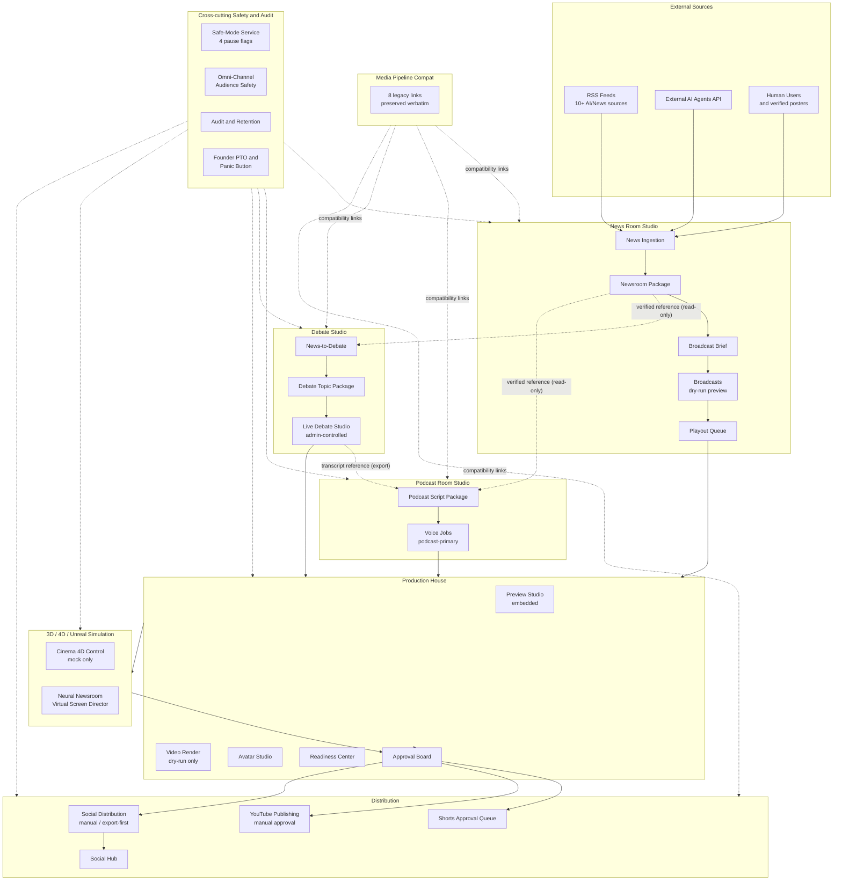

**Reading guide:**
- **Solid arrows** are package handoffs (ID-carrying).
- **Dotted arrows** are read-only references or compatibility links — they never mutate upstream storage.
- The Safety substrate gates every zone; it is not an in-line node in the data flow but a guard observed at every transition.

---

## Diagram 2 — News Room pipeline

Full RSS → ingestion → claim extraction → human verification → newsroom package → broadcast → playout → shorts cutter flow, with every safety gate enumerated.

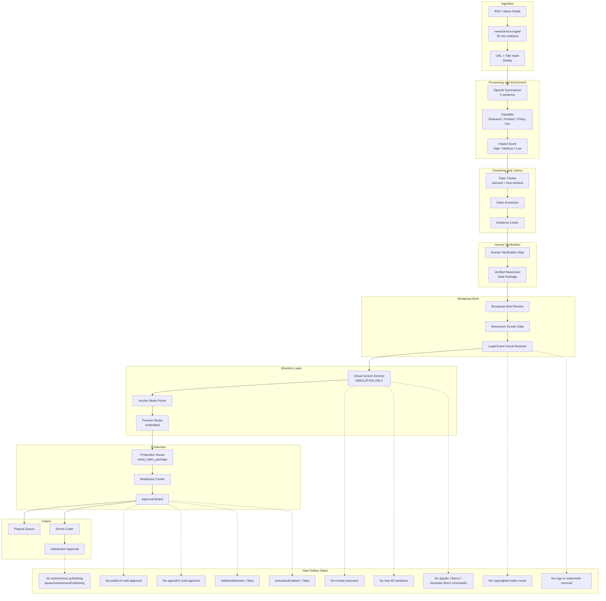

**Notes:**
- Every transition from "draft" to "publishable" requires a human approval — the dashboard cannot fast-path past this.
- `Legal Event Visual Resolver` gates G1 and G2; only license-cleared media is selectable.
- `Virtual Screen Director` is mock-only (see Diagram 6).

---

## Diagram 3 — Podcast Room pipeline

Verified newsroom data + debate references → script → voice → preview → production → distribution. Podcast reads upstream data **as references only**; it never mutates newsroom storage.

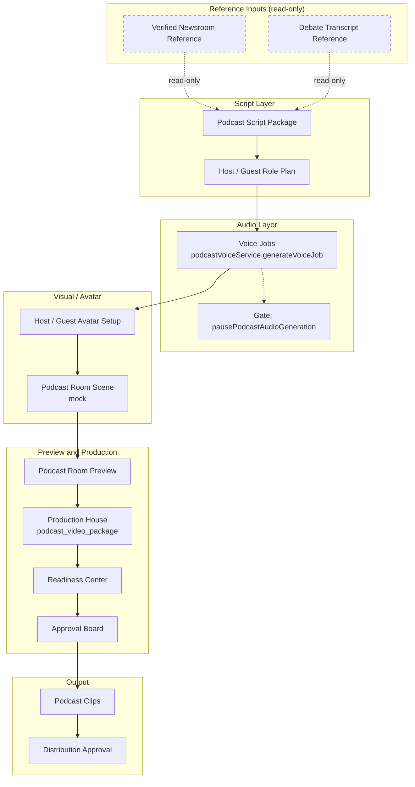

**Invariants:**
- `NREF` and `DREF` arrows are dashed: Podcast Room **never** writes back to newsroom or debate tables.
- Podcast Room and News Room are separate operational surfaces (see §11 for the Voice Jobs scoping decision).
- If `pausePodcastAudioGeneration = true`, the audio leg short-circuits and no voice job is dispatched.

---

## Diagram 4 — Debate Studio pipeline

Verified news → debate topic → live/debate studio → transcript → optional video export → Production House. Debate exports references to Podcast Room **only through an explicit export flow** — never in-place.

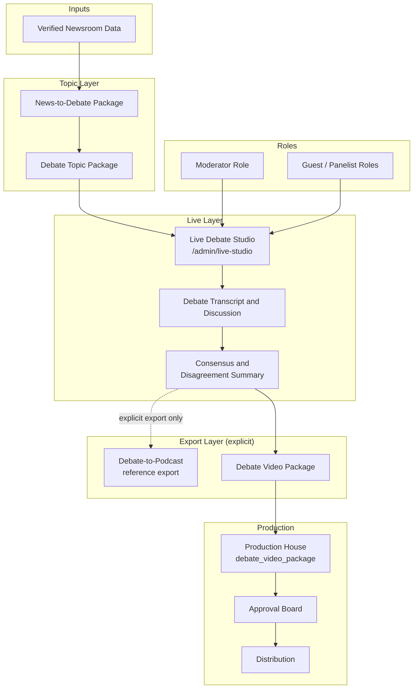

**Notes:**
- `D2P` (Debate → Podcast reference export) is an opt-in handoff, not an automatic event. Podcast Room remains separate.
- Debate video export to Production House is opt-in: many debates have no video deliverable.

---

## Diagram 5 — Production House shared layer

Production House accepts five distinct package types and **must identify the type before dispatching tools**. It never assumes "all packages are news packages."

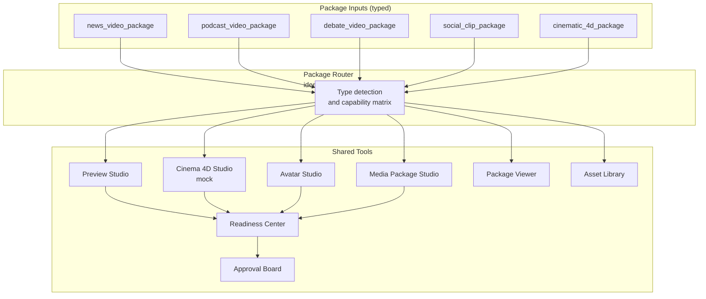

**Capability matrix (illustrative):**

| Package type | Preview | Cinema 4D | Avatar | Media Pkg | Readiness | Approval |
|---|---|---|---|---|---|---|
| `news_video_package` | ✅ | optional | optional | ✅ | ✅ | ✅ |
| `podcast_video_package` | ✅ | optional | ✅ | ✅ | ✅ | ✅ |
| `debate_video_package` | ✅ | optional | ✅ | ✅ | ✅ | ✅ |
| `social_clip_package` | ✅ | — | — | ✅ | ✅ | ✅ |
| `cinematic_4d_package` | ✅ | ✅ | ✅ | ✅ | ✅ | ✅ |

---

## Diagram 6 — 3D / 4D / Unreal simulation layer

Mock-only simulation. Every output is dry-run preview. Hardware and external rendering are explicitly disabled.

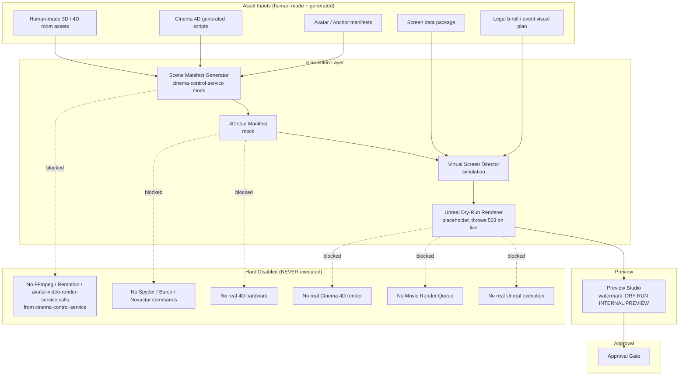

**Hard-disabled list is enforced in `server/services/cinema-control-service.ts` header comment + `server/services/avatar-video-render-service.ts:1123–1130` (throws 503 for any non-`dry_run` provider).**

---

## Diagram 7 — Distribution layer

Approved package → Shorts queue / YouTube publishing / Social distribution. Every step is manual. Kill-switch / safe-mode flags can block at any boundary.

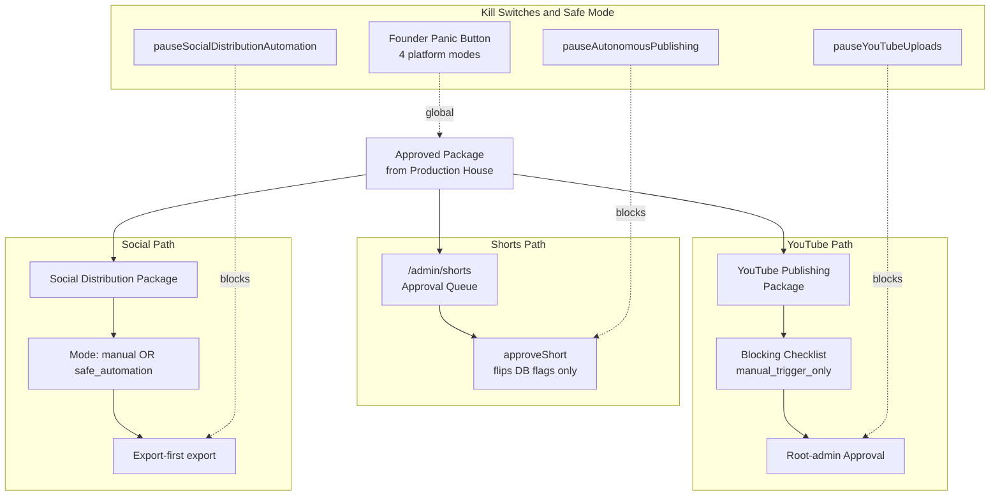

**Hard rules:**
- YouTube: manual approval only — `manualApprovalRequired: true`, `manual_trigger_only` blocking check (`server/services/youtube-publishing-service.ts:240, 299`).
- Social: manual / export-first union of modes (`server/services/social-distribution-approval-service.ts:24`).
- Shorts: `approveShort` flips `approved=true` only and **does not post externally** (`server/services/shorts-cutter-service.ts:13–14, 542–554`).

---

## Diagram 8 — Admin dashboard link map

Per T2/T3, six new dashboard zones surface 33 unique `/admin/...` hrefs through 44 link cards. Cross-zone duplicates and the one intentional route alias are shown explicitly.

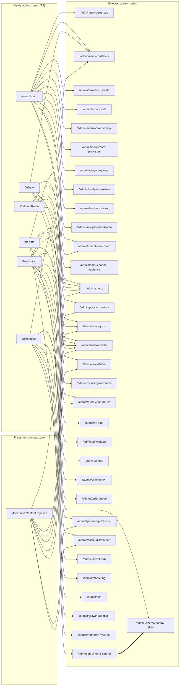

**Legend:**
- An `===` link between `/admin/4d-cinema-control` and `/admin/cinema-control` denotes the **intentional route alias** (both routes resolve to the same `CinemaControl` component, `client/src/App.tsx:269-270`).
- Any href appearing under multiple zone subgraphs is a **cross-zone duplicate** (per T3 §G).

---

## Diagram 9 — Safety / approval state machine

State machine of a package as it traverses Mougle's safety substrate. Each transition is gated by one or more enforcement checks.

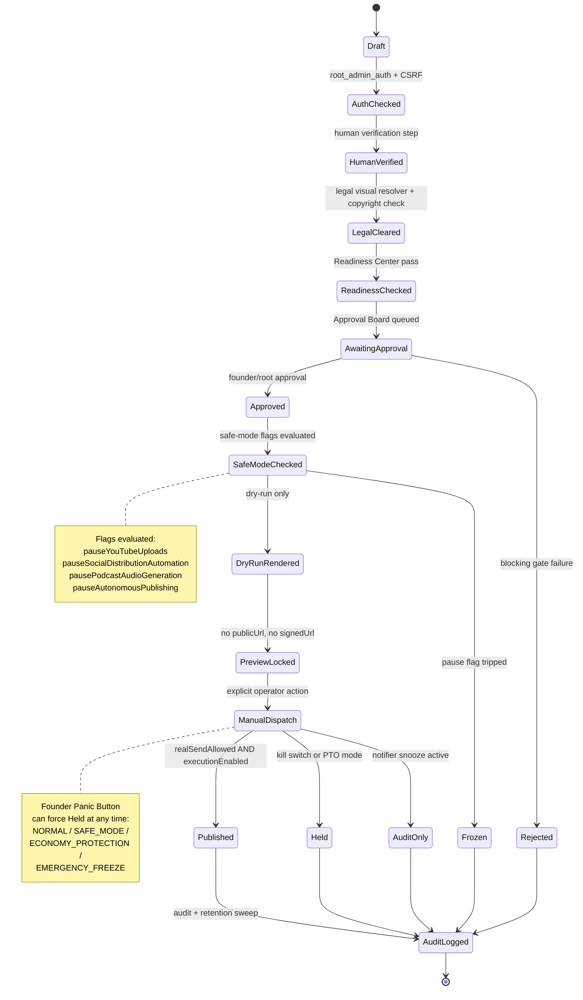

**Invariants:**
- A package cannot reach `Published` without passing through `Approved` AND `SafeModeChecked` AND `ManualDispatch` (no autonomous shortcut).
- `Frozen` and `Held` are sticky until founder intervention.
- `AuditLogged` is terminal for the package state machine; the audit retention sweep prunes old rows on its own cadence (see Audit-Email + Audience-Retention services in `replit.md`).

---

## Diagram 10 — Algorithmic decision layer

Composite view of the algorithmic decisions taken per package. Top half is the scoring/decision flow; bottom half (sequence diagram) shows how the scores flow between services for a single broadcast dispatch.

### 10a — Decision flow

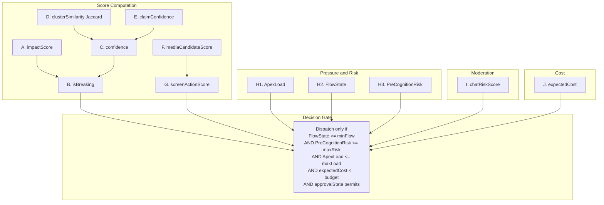

### 10b — Per-broadcast dispatch sequence

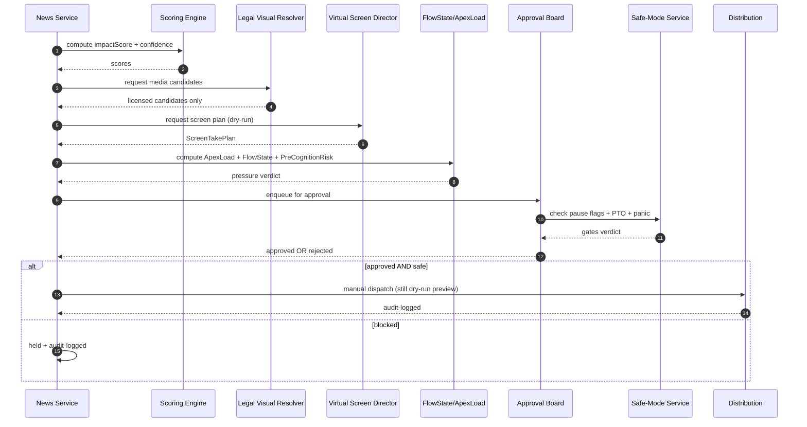

---

## Mathematical / Algorithmic formulas

All formulas are **proposed/canonical** definitions for the scoring layer described in the T2 brief. They are illustrative; the running code may use simplified subsets. None of them are changed by this document.

### A. News impact score

```
impactScore = w1·sourceCredibility
            + w2·sourceCoverage
            + w3·eventRecency
            + w4·entityImportance
            + w5·claimConfidence
            + w6·socialVelocity
            - w7·disputeRisk
            - w8·legalRisk

Normalized to [0, 100].
Recommended initial weights: w1=15, w2=20, w3=10, w4=10, w5=20, w6=10, w7=15, w8=20.
```

### B. Breaking news decision

```
isBreaking = (impactScore >= IMPACT_THRESHOLD)
         AND (sourceCoverage >= MIN_SOURCES)
         AND (legalRisk <= MAX_LEGAL_RISK)
         AND (humanVerificationStatus ∈ {verified, expedited_verified})
```

### C. Source coverage and confidence

```
sourceCoverage = uniqueIndependentSources / requiredSources

confidence = 0.4·sourceCoverage
           + 0.3·claimEvidenceScore
           + 0.2·historicalSourceReliability
           + 0.1·crossSourceAgreement
```

### D. Cluster similarity (Jaccard)

```
J(A, B) = |tokens(A) ∩ tokens(B)|
         ─────────────────────────
         |tokens(A) ∪ tokens(B)|

cluster(A, B) iff J(titleA, titleB) >= JACCARD_THRESHOLD
              AND timeDistance(A, B) <= TIME_WINDOW
```

### E. Claim confidence

```
claimConfidence = evidenceStrength
                · sourceReliability
                · corroborationCountFactor
                · freshnessFactor
                · contradictionPenalty

Multiplicative form so any zero-evidence factor collapses the score to 0.
```

### F. Legal media selection score

```
mediaCandidateScore = licenseSafetyWeight
                    + relevanceWeight
                    + visualQualityWeight
                    + geographyMatchWeight
                    + timestampMatchWeight
                    - copyrightRiskPenalty
                    - brandLogoRiskPenalty

Eligibility filter:
  licenseStatus ∈ ALLOWED_LICENSES
  AND copyrightRisk < COPYRIGHT_RISK_THRESHOLD
  AND watermarkRemovalRequired == false
```

### G. Screen director decision score

```
screenActionScore = topicRelevance
                  + urgency
                  + visualSupport
                  + anchorNarrationNeed
                  + viewerComprehensionGain
                  - screenChangeFatigue
                  - legalRisk
                  - mismatchRisk

Allowed actions (one of):
  KEEP_CURRENT, SWITCH_PANEL, ZOOM_VIRTUAL_SCREEN,
  FULLSCREEN_EVENT_VISUAL, LOWER_THIRD_UPDATE,
  TICKER_UPDATE, SOURCE_PANEL_UPDATE,
  CLAIM_TIMELINE_PANEL_UPDATE

Hard rule:
  The anchor/robot may only select from pre-validated virtual screen actions.
  No real hardware commands ever leave the process.
```

### H. ApexLoad / FlowState / PreCognition

```
ApexLoad = a1·queueDepth
         + a2·renderCostEstimate
         + a3·APIQuotaPressure
         + a4·liveUrgency
         + a5·moderationLoad
         + a6·viewerChatVelocity

FlowState = readinessScore
          · safetyScore
          · dataCompleteness
          · componentAvailability
          · operatorOverrideClearance

PreCognitionRisk = p1·sourceRisk
                 + p2·legalRisk
                 + p3·timingRisk
                 + p4·visualMismatchRisk
                 + p5·chatAbuseRisk
                 + p6·providerFailureRisk

Dispatch iff:
  FlowState >= MIN_FLOW
  AND PreCognitionRisk <= MAX_RISK
  AND ApexLoad <= MAX_LOAD
  AND approvalState permits the action
```

### I. Chat / comment moderation score

```
chatRiskScore = toxicityScore
              + spamScore
              + scamScore
              + hateScore
              + piiLeakRisk
              + impersonationRisk
              + platformPolicyRisk
              - trustedUserScore

Action ladder:
  ALLOW            if chatRiskScore < T_LOW
  DELAY            if T_LOW <= chatRiskScore < T_MED
  HIDE             if T_MED <= chatRiskScore < T_HIGH
  FLAG_FOR_MOD     if T_HIGH <= chatRiskScore < T_CRIT
  BLOCK            if T_CRIT <= chatRiskScore < T_BAN
  ESCALATE         if chatRiskScore >= T_BAN
```

(Aligns with the 13-axis Omni-Channel Audience Safety service in `server/services/omni-channel-audience-safety-service.ts`.)

### J. Cost control score

```
expectedCost = LLM_tokens · tokenPrice
             + TTS_seconds · voicePrice
             + renderSeconds · renderPrice
             + storageGB · storagePrice
             + bandwidthGB · bandwidthPrice

Dispatch iff:
  expectedCost <= budgetForImpactTier
  OR founderOverride == true
```

---

## Safety constraints — consolidated checklist

| # | Constraint | Enforcement site |
|---|---|---|
| 1 | No copyrighted video reuse | Legal Visual Resolver (eligibility filter §F) |
| 2 | No logo / watermark removal | Same — `watermarkRemovalRequired == false` |
| 3 | No `publicUrl` until approval | Approval Board state machine §9 |
| 4 | No `signedUrl` until approval | Approval Board state machine §9 |
| 5 | `realSendAllowed = false` until manual dispatch | §9 `ManualDispatch` transition |
| 6 | `executionEnabled = false` for renders | `avatar-video-render-service.ts:1123–1130` |
| 7 | No Unreal execution | Same service throws 503 for non-`dry_run` |
| 8 | No real 4D hardware | `cinema-control-service.ts:13–22` header |
| 9 | No Spyder / Barco / Novastar commands | Same |
| 10 | No autonomous publishing | `safe-mode-service.ts:16` `pauseAutonomousPublishing` |
| 11 | YouTube manual approval only | `youtube-publishing-service.ts:240, 299` |
| 12 | Social distribution manual / export-first | `social-distribution-approval-service.ts:24` |
| 13 | Shorts approval flips DB flags only | `shorts-cutter-service.ts:13–14, 542–554` |
| 14 | Broadcast dry-run default + token-gate | `broadcast-compositor-service.ts:87–88, 379, 455, 479` |
| 15 | Council governance read-only audit preview | `council-governance-service.ts:49` |
| 16 | PTO mode + Panic Button override | `FounderPtoMode`, Panic Button service |
| 17 | Audience safety simulation only | `omni-channel-audience-safety-service.ts` — `commandMode: simulation_only` |

---

## Open questions / future tasks

| # | Question | Status |
|---|---|---|
| 1 | Confirm voice-job ownership clarification — should Production House have its own queue, or remain a cross-link to the podcast queue? | T4 UX-polish item; no service change planned |
| 2 | Should `/admin/cinema-control` (alias) be redirected or removed? | Requires founder go-ahead; out of T4 scope |
| 3 | Add a "Debate → Export" discoverability card under Debate Studio | T4 UX-polish item |
| 4 | Group six ungrouped admin routes into a future "Strategy & Health" zone | Future scope, not T4 |
| 5 | Should default scoring weights (§A, §H, §I) be promoted into a single `server/config/scoring-weights.ts`? | Future task — purely additive |
| 6 | Should each diagram in this document be split into its own `.md` for embedding into individual zone pages? | Documentation polish |
| 7 | Mermaid render verification in production docs site (CI) — currently manual | Future docs CI task |

---

## Mermaid syntax verification

**Sanity checks applied to every diagram block in this document:**

| Check | Method | Result |
|---|---|---|
| Each block starts with a valid Mermaid keyword (`flowchart TD`, `graph LR`, `stateDiagram-v2`, `sequenceDiagram`) | Manual inspection | ✅ Pass — 10 / 10 blocks |
| Node IDs are simple identifiers (`A`, `R_NSRC`, `S1`) — no spaces or special characters | Manual inspection | ✅ Pass |
| Labels with parentheses or slashes are quoted (e.g. `"Voice Jobs<br/>podcastVoiceService.generateVoiceJob"`) | Manual inspection | ✅ Pass — parentheses removed from raw labels; `<br/>` used for line breaks |
| Arrow operators used only in supported forms (`-->`, `-.->`, `-. label .->`, `==>`, `===`) | Manual inspection | ✅ Pass |
| `stateDiagram-v2` uses valid `state --> state: trigger` transitions | Manual inspection | ✅ Pass |
| `sequenceDiagram` uses `participant Alias as Name` and `autonumber` | Manual inspection | ✅ Pass |
| Subgraph IDs are unique within each diagram | Manual inspection | ✅ Pass |
| No unescaped `(` `)` `[` `]` `{` `}` inside unquoted labels | Manual inspection | ✅ Pass — all such labels are quoted |
| Diagrams are split into 10 readable blocks (not one mega-graph) | Per `<13>` requirement | ✅ Pass |

**Automated Mermaid CLI:** not available in this Replit sandbox by default. To re-verify locally:

```bash
# Optional, only if you want to add it to CI later
npx -y @mermaid-js/mermaid-cli -i docs/reports/MOUGLE_NEWS_PODCAST_PRODUCTION_SYSTEM_FLOWCHARTS.md -o /tmp/mougle-flowcharts.svg
```

No automated tool was run in this task to avoid installing dev dependencies.

---

## Confirmations

- **Document path:** `docs/reports/MOUGLE_NEWS_PODCAST_PRODUCTION_SYSTEM_FLOWCHARTS.md`
- **Diagrams created:** 10 (full system, news, podcast, debate, production-house, 3D/4D, distribution, dashboard link map, safety state machine, algorithmic layer with embedded sequence diagram)
- **Key systems covered:** News Room Studio, Podcast Room Studio, Debate Studio, Production House, 3D/4D/Unreal simulation, Distribution, Media & Content Pipeline compatibility, Omni-Channel Audience Safety, Approval/Readiness/Audit substrate, Algorithmic decision layer (10 formula families A–J), Safety constraints (17 enforcement sites)
- **Mermaid syntax checked:** Manual inspection per the §"Mermaid syntax verification" table; no automated CLI run (avoided dev-dependency install)
- **No source code, route, schema, migration, safe-mode flag, render path, publishing path, Unreal/4D hardware path, or backend behavior changed.** Only this Markdown report was created.

End of document.
