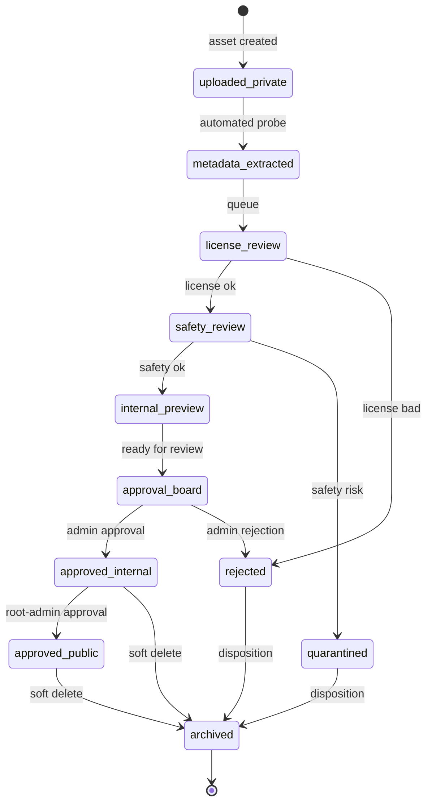
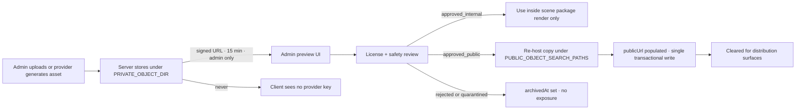
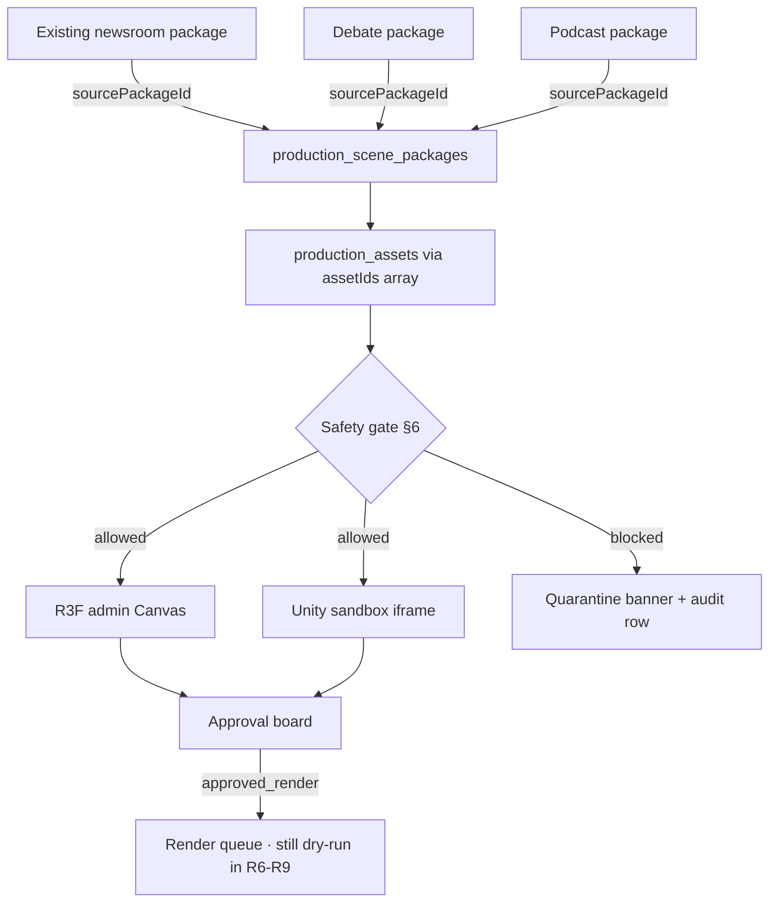
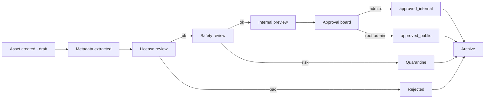
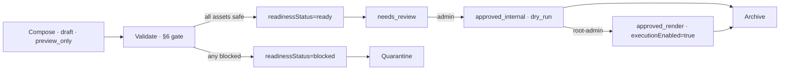

# R4 — 3D / R3F Asset Metadata + Safety Gate Design

**Date:** 2026-05-22
**Phase:** R4 of the R-series R3F / WebGL / Unity integration roadmap
**Prompt source:** founder brief — "Start R4 — 3D/R3F Asset Metadata + Safety Gate Design"
**Status:** ✅ DONE — design only · no code · no schema · no migration · no route · no behavior change
**Maintainer:** root-admin / founder

---

## A. Task title
R4 — 3D / R3F Asset Metadata + Safety Gate Design (design only)

## B. Date
2026-05-22

## C. Prompt / request summary
Design (no code) the asset metadata, safety status, approval status, and package relationship model for Mougle's future 3D / 4D / R3F / WebGL / Unity Production House surface. Pure design contract for R5+. Hard rules: no tables created, no migrations, no routes, no upload flows, no GLB/GLTF loading, no Production House runtime touch, no render / publish / Unity / Unreal / Cinema 4D / 4D-hardware execution.

## D. Goal
Land a deliberate, citable contract that R5-R10 can build against, where every default sits at the safest value and every state transition is gated, audited, and reversible.

## E. Scope (what is in this task)
- One new design report: `docs/reports/R3F_ASSET_METADATA_SAFETY_MODEL_R4_DESIGN.md` (this file)
- One line added to `docs/library/INDEX.md`
- 14 numbered design sections + 5 Mermaid diagrams + state machine + R5 recommendation
- Zero code, zero schema, zero route, zero behavior change

## F. Explicit non-goals (R4)
- ❌ No edit to `shared/schema.ts`
- ❌ No new migration / no `drizzle-kit` run / no `db:push`
- ❌ No new server route / no new client page
- ❌ No upload form, no signed-URL generation, no public URL minting
- ❌ No GLB / GLTF / texture / HDRI / Unity / Cinema-4D loader
- ❌ No Production-House integration, no render execution, no publishing
- ❌ No provider API call (OpenAI / Meshy / Runway / ElevenLabs / HeyGen / Unreal / 4D hardware)
- ❌ No environment-secret read from any new surface
- ❌ No change to the R3 sandbox page or any other admin page

---

# 1. Current baseline (as of 2026-05-22)

| Item | State | Source |
|---|---|---|
| R3F sandbox page | ✅ live at `/admin/r3f-preview-sandbox` (admin-only, dry-run, 8 safety badges) | `client/src/pages/admin/R3FPreviewSandbox.tsx` (R3 task) |
| R3F Canvas wrapper | ✅ `client/src/components/production-house/r3f/ProductionCanvasSandbox.tsx` — primitives only, grid, OrbitControls, WebGL fallback, `dpr=[1,1.5]`, `frameloop="demand"` | R3 report |
| `@react-three/fiber` | ✅ `^9.6.1` | `package.json` |
| `@react-three/drei` | ✅ `^10.7.7` | `package.json` |
| `@react-three/test-renderer` | ✅ `^9.1.0` (devDependency) | `package.json` |
| `three` | ✅ `^0.183.0` | `package.json` |
| `@types/three` | ✅ `^0.183.0` | `package.json` |
| `troika-three-text` | ✅ `^0.52.4` | `package.json` |
| React | ✅ `19.2.3` — R3F v9 compatible | R1 §1 |
| Real model loading | ❌ none | R3 |
| Real render / export / live / publish | ❌ none enabled | R3 + R1 §4 |
| Existing production-house service | uses in-memory mocks with `approvalStatus: "draft"` hard-coded literal (server/services/production-house-service.ts) | grep finding |
| Existing object-storage usage | `PRIVATE_OBJECT_DIR` only — for `anchors/`, `shorts/`, `broadcasts/` (read-only convention) | server/services grep |

R4 introduces no new runtime behavior on top of this baseline.

---

# 2. Asset types covered

The metadata model must accommodate all of the following asset classes. Each class is identified by `assetType` (string enum). Future R5+ tables will store one row per asset regardless of class — the differentiator is `assetType` plus class-specific fields inside `dimensionsJson` / `manifestJson`.

| `assetType` | Examples | Loader (future) | Class notes |
|---|---|---|---|
| `glb_model` | `.glb` 3D model | `useGLTF` (drei) | Single binary |
| `gltf_model` | `.gltf` + dependencies | `useGLTF` (drei) | Multi-file; dependent files referenced by `manifestJson` |
| `texture` | `.ktx2`, `.png`, `.jpg`, `.webp` | `useTexture` / `useKTX2` (drei) | Color-space declared in `dimensionsJson` |
| `hdri_environment` | `.hdr`, `.exr` | `useEnvironment` (drei) | Sky/IBL only |
| `avatar_rig` | Skeleton + base mesh `.glb` | `useGLTF` + skinned mesh | Rig spec in `manifestJson.rig` |
| `avatar_outfit` | Clothing / accessory `.glb` | composed on top of rig | Links via `parentAssetId` to a rig |
| `newsroom_set` | Studio newsroom `.glb` | scene compose | `sceneType: "newsroom"` |
| `podcast_room_set` | Podcast room `.glb` | scene compose | `sceneType: "podcast_room"` |
| `debate_room_set` | Debate stage `.glb` | scene compose | `sceneType: "debate_room"` |
| `prop` | Mic, mug, chair `.glb` | scene compose | optional, can be auto-placed |
| `screen_panel` | Backdrop screen mesh | scene compose | flagged for video-texture target |
| `lower_third_overlay` | 2D PNG / SVG / JSON layout | HTML overlay or texture | not 3D; safety still applies |
| `event_backdrop` | Concert / hall backdrop `.glb` | scene compose | optional 4D hardware target later |
| `unity_webgl_build` | Unity `Build/{loader.js,data,framework.js,wasm}` | sandboxed `<iframe>` | NEVER inside R3F Canvas (R1 §2) |
| `cinema4d_export` | Baked `.glb` / `.fbx` from Cinema 4D | `useGLTF` | Source workflow is offline |
| `meshy_generated` | Meshy provider `.glb` | `useGLTF` | `sourceProvider: "meshy"` |
| `runway_generated_video` | Background video `.mp4` / `.webm` | `useVideoTexture` | not a mesh; metadata still tracked |
| `human_made_room` | Hand-modeled 3D/4D room `.glb` | `useGLTF` | `sourceType: "human_artist"` |
| `social_clip_3d_package` | Composed 3D shot for shorts | scene package | upstream of social distribution |

`assetType` is open-ended — adding a new class in R5+ does **not** require a schema change, only a new enum value (additive).

---

# 3. Proposed tables (additive only · DESIGN ONLY)

> ⚠️ **None of these tables are created in R4.** This is a contract for R5+ to implement.
> No edits to `shared/schema.ts`, no `migrations/*` files, no `db:push` run.

## 3.A `production_assets`

Single row per uploaded or provider-generated asset.

| Column | Type | Notes |
|---|---|---|
| `id` | `varchar` PK (uuid) | |
| `assetType` | `text` | Enum value from §2 |
| `title` | `text` | Human-readable |
| `description` | `text` nullable | |
| `sourceType` | `text` | `human_upload`, `provider_generated`, `system_seed` |
| `sourceProvider` | `text` nullable | `meshy`, `runway`, `cinema4d`, `unity`, `human_artist`, `mougle_system` |
| `sourceId` | `text` nullable | Provider's external job/asset id |
| `originalFileName` | `text` | |
| `objectPath` | `text` | Path inside `PRIVATE_OBJECT_DIR/production-assets/{assetId}/original` |
| `previewThumbnailPath` | `text` nullable | Path inside `PRIVATE_OBJECT_DIR/production-assets/{assetId}/preview` |
| `modelFormat` | `text` | `glb`, `gltf`, `ktx2`, `hdr`, `png`, `mp4`, `webgl_build`, … |
| `mimeType` | `text` | |
| `sizeBytes` | `bigint` | |
| `checksumSha256` | `text` | dedup + integrity |
| `dimensionsJson` | `jsonb` | `{ width, height, depth?, polyCount?, vertexCount?, materialCount?, animationCount?, colorSpace? }` |
| `durationMs` | `integer` nullable | for video/anim |
| `licenseStatus` | `text` | Enum §4 · default `unknown` |
| `licenseSource` | `text` nullable | e.g. `CC-BY-4.0`, `internal`, `commercial` |
| `licenseNotes` | `text` nullable | |
| `copyrightRisk` | `text` | `low`, `medium`, `high`, `unknown` · default `unknown` |
| `brandLogoRisk` | `text` | `none`, `possible`, `confirmed`, `unknown` · default `unknown` |
| `publicSafetyStatus` | `text` | Enum §4 · default `admin_preview_only` |
| `approvalStatus` | `text` | Enum §4 · default `draft` |
| `approvedBy` | `varchar` nullable | actor id |
| `approvedAt` | `timestamptz` nullable | |
| `rejectedBy` | `varchar` nullable | |
| `rejectedAt` | `timestamptz` nullable | |
| `rejectionReason` | `text` nullable | |
| `publicSafePreview` | `boolean` | default **false** |
| `publicUrl` | `text` nullable | default **null** (NEVER set without approved_public) |
| `signedUrl` | `text` nullable | default **null** (admin-only signed view; expires) |
| `createdBy` | `varchar` | actor id |
| `createdAt` | `timestamptz` default `now()` | |
| `updatedAt` | `timestamptz` default `now()` | |
| `archivedAt` | `timestamptz` nullable | soft delete |

Indexes (suggested for R5+): `(assetType)`, `(approvalStatus)`, `(publicSafetyStatus)`, `(checksumSha256)`, `(createdAt)`, `(archivedAt)`.

## 3.B `production_scene_packages`

Single row per composed scene/package (groups assets into a renderable unit).

| Column | Type | Notes |
|---|---|---|
| `id` | `varchar` PK | |
| `packageType` | `text` enum | `news_video`, `podcast_video`, `debate_video`, `social_clip`, `cinematic_4d_package`, `unity_webgl_preview`, `r3f_preview` |
| `sceneType` | `text` enum | `newsroom`, `podcast_room`, `debate_room`, `studio_set`, `event_visual`, `avatar_preview`, `screen_wall` |
| `title` | `text` | |
| `description` | `text` nullable | |
| `sourcePackageId` | `varchar` nullable | Cross-link (e.g., the news package that spawned this scene) |
| `sourcePackageType` | `text` nullable | `newsroom_package`, `debate_package`, `podcast_package`, … |
| `assetIds` | `text[]` | References `production_assets.id` |
| `sceneManifestJson` | `jsonb` | Scene graph snapshot |
| `cameraManifestJson` | `jsonb` | Camera presets / animations |
| `lightingManifestJson` | `jsonb` | Lighting presets |
| `interactionManifestJson` | `jsonb` | Allowed user interactions (OrbitControls, hotspots, etc.) |
| `safetyManifestJson` | `jsonb` | Per-asset safety snapshot at compose time |
| `renderMode` | `text` enum | `preview_only`, `dry_run`, `approved_render` · default `preview_only` |
| `approvalStatus` | `text` enum | §4 · default `draft` |
| `readinessStatus` | `text` enum | `not_ready`, `ready`, `blocked` · default `not_ready` |
| `publicSafePreview` | `boolean` | default **false** |
| `publicUrl` | `text` nullable | default **null** |
| `signedUrl` | `text` nullable | default **null** |
| `realSendAllowed` | `boolean` | default **false** |
| `executionEnabled` | `boolean` | default **false** |
| `createdBy` | `varchar` | |
| `createdAt` | `timestamptz` default `now()` | |
| `updatedAt` | `timestamptz` default `now()` | |
| `archivedAt` | `timestamptz` nullable | |

Indexes (suggested): `(packageType)`, `(sceneType)`, `(approvalStatus)`, `(renderMode)`, `(sourcePackageId)`, `(createdAt)`.

## 3.C `production_asset_audit_log`

| Column | Type | Notes |
|---|---|---|
| `id` | `varchar` PK | |
| `assetId` | `varchar` FK → `production_assets.id` | |
| `action` | `text` | `created`, `metadata_extracted`, `license_set`, `approved_internal`, `approved_public`, `rejected`, `quarantined`, `archived`, `restored`, `signed_url_minted`, `signed_url_revoked`, … |
| `actorId` | `varchar` | |
| `occurredAt` | `timestamptz` default `now()` | |
| `previousStatusJson` | `jsonb` nullable | snapshot of approval + safety + license fields before |
| `newStatusJson` | `jsonb` nullable | snapshot after |
| `notes` | `text` nullable | |
| `sourceIp` | `text` nullable | only if current admin-audit patterns include this (Mougle's existing audit tables mostly do — verify in R5) |
| `userAgent` | `text` nullable | same caveat |

Indexes: `(assetId, occurredAt)`, `(actorId)`, `(action)`.

## 3.D `production_scene_package_audit_log`

Same shape as 3.C, scoped to `scenePackageId`.

| Column | Type |
|---|---|
| `id`, `scenePackageId`, `action`, `actorId`, `occurredAt`, `previousStatusJson`, `newStatusJson`, `notes`, `sourceIp?`, `userAgent?` | as above |

Indexes: `(scenePackageId, occurredAt)`, `(actorId)`, `(action)`.

**Audit log retention** should align with `audience-retention-service.ts` patterns (admin-only, configurable window, soft-archive then prune). Defer policy details to R5+.

---

# 4. Safety statuses — enums + allowed transitions

## 4.A `licenseStatus`
```
unknown → pending_review → licensed
                       ↘ rejected
licensed             → expired   (time-based)
internal_only        (terminal-friendly; never auto-promoted to licensed)
```
Allowed values: `unknown`, `pending_review`, `licensed`, `internal_only`, `rejected`, `expired`.
**Default:** `unknown`.

## 4.B `publicSafetyStatus`
```
private_only ← (default for provider_generated draft)
admin_preview_only ← (default for human_upload)
safe_for_internal_review
safe_for_public_preview ← only after approved_public
blocked ← terminal until manually cleared
```
Allowed values: `private_only`, `admin_preview_only`, `safe_for_internal_review`, `safe_for_public_preview`, `blocked`.
**Default:** `admin_preview_only` for human uploads; `private_only` for provider-generated assets until human review.

## 4.C `approvalStatus`
```
draft → needs_review → approved_internal → approved_public
                 ↘ rejected
                 ↘ quarantined
approved_internal → archived
approved_public   → archived
```
Allowed values: `draft`, `needs_review`, `approved_internal`, `approved_public`, `rejected`, `archived`, `quarantined`.
**Default:** `draft`.

## 4.D `renderMode`
```
preview_only → dry_run → approved_render
```
Allowed values: `preview_only`, `dry_run`, `approved_render`.
**Default:** `preview_only`.

## 4.E Safest defaults (MUST hold across every new row)

| Field | Default |
|---|---|
| `publicSafetyStatus` | `admin_preview_only` (uploads) / `private_only` (provider) |
| `approvalStatus` | `draft` |
| `renderMode` | `preview_only` |
| `publicSafePreview` | `false` |
| `publicUrl` | `null` |
| `signedUrl` | `null` |
| `realSendAllowed` | `false` |
| `executionEnabled` | `false` |
| `licenseStatus` | `unknown` |
| `copyrightRisk` | `unknown` |
| `brandLogoRisk` | `unknown` |

These defaults are **non-negotiable** and must be enforced both by Drizzle column defaults and by application-layer Zod validators in R5+.

---

# 5. State machine (Mermaid)



**Hard invariants:**
- `publicUrl` may be non-null **only** when `approvalStatus = approved_public` **and** `publicSafetyStatus = safe_for_public_preview`.
- `executionEnabled = true` requires `renderMode = approved_render` **and** `approvalStatus ∈ {approved_internal, approved_public}`.
- `realSendAllowed = true` requires an explicit `realSendApproval` audit log entry (per-package, per-distribution-channel).
- `quarantined` and `rejected` are terminal-with-recovery: only an explicit admin action can re-enter the flow at `safety_review`.

---

# 6. R3F safety-gate validation rules

The following pure functions must live in a future `server/services/production-asset-safety.ts` (R5+) and be exhaustively unit-tested. **All return `{ allowed: boolean; reasons: string[] }`** — never throw, never side-effect.

| Function | Inputs | Required checks |
|---|---|---|
| `canPreviewAssetInAdmin(asset)` | asset row | `archivedAt == null` · `approvalStatus != quarantined` · `objectPath` resolves under `PRIVATE_OBJECT_DIR` |
| `canUseAssetInScene(asset, scenePackage)` | asset + package | `licenseStatus ∈ {licensed, internal_only}` · `approvalStatus ∈ {approved_internal, approved_public}` · `publicSafetyStatus != blocked` · asset not archived · scene package not archived |
| `canExposeAssetPublicly(asset)` | asset row | `approvalStatus == approved_public` · `publicSafetyStatus == safe_for_public_preview` · `licenseStatus == licensed` · `copyrightRisk == low` · `brandLogoRisk ∈ {none}` |
| `canRenderScenePackage(scenePackage)` | package row | `renderMode == approved_render` · `approvalStatus == approved_internal or approved_public` · `executionEnabled == true` · every linked asset passes `canUseAssetInScene` |
| `canUseUnityBuild(scenePackage)` | package with `packageType == unity_webgl_preview` | iframe origin allow-list · `signedUrl != null` (admin) **or** asset is `approved_public` · postMessage allow-list set |
| `canUseAvatarRig(asset)` | asset with `assetType == avatar_rig` | rig manifest validates against schema · `licenseStatus == licensed` · no nested provider asset is `rejected` or `quarantined` |
| `canUseProviderGeneratedAsset(asset)` | asset with `sourceType == provider_generated` | provenance recorded · `sourceProvider` in allow-list · human review confirmed (`approvalStatus ∈ {approved_internal, approved_public}`) · disclosure metadata present |

Each check **MUST** evaluate:
- `licenseStatus`
- `publicSafetyStatus`
- `approvalStatus`
- `objectPath` prefix (private vs public)
- `publicUrl` / `signedUrl` state
- `renderMode`
- `executionEnabled`
- `realSendAllowed` (where applicable)

---

# 7. Object storage policy

## 7.A Private paths (admin-only · signed URL access)
```
PRIVATE_OBJECT_DIR/production-assets/{assetId}/original
PRIVATE_OBJECT_DIR/production-assets/{assetId}/preview
PRIVATE_OBJECT_DIR/scene-packages/{packageId}/manifest.json
PRIVATE_OBJECT_DIR/scene-packages/{packageId}/preview.png
```

## 7.B Public paths (only after `approved_public`)
```
PUBLIC_OBJECT_SEARCH_PATHS/production-assets/{assetId}/public-preview
PUBLIC_OBJECT_SEARCH_PATHS/scene-packages/{packageId}/public-preview
```

## 7.C Rules

1. Private assets are reachable **only** through short-lived admin signed URLs (TTL ≤ 15 min; configurable).
2. `publicUrl` remains `NULL` until `approvalStatus == approved_public`. Setting it is a single transactional write that also emits a `signed_url_minted` audit entry.
3. **No client-side provider credentials.** Frontend never sees Meshy / Runway / OpenAI keys. R3F sandbox in particular reads no env secrets (already enforced in R3).
4. No direct bucket browsing — admin UI lists assets through `/api/admin/production/assets` only.
5. No public asset is ever written under `PRIVATE_OBJECT_DIR`, and no private asset is ever written under `PUBLIC_OBJECT_SEARCH_PATHS`.
6. Provider-generated assets (Meshy / Runway) are downloaded server-side and re-hosted under `PRIVATE_OBJECT_DIR`. They never reference the provider's CDN at runtime.
7. Soft-delete (`archivedAt`) hides the asset from listing but the object remains until a separate retention pass prunes it (align with `audience-retention-service.ts` pattern).

## 7.D Privacy data-flow (Mermaid)



---

# 8. Production House integration plan (forward-looking)

| Phase | Surface | Reads | Writes | Notes |
|---|---|---|---|---|
| R5 | Static GLB loader (or schema-first; see §13) | `production_assets` (one approved seed row) **OR** none if 5B chosen | none | First real loader; admin-only |
| R6 | Virtual set preview | `production_assets` + `production_scene_packages` | scene manifests | Renders inside admin Canvas |
| R7 | Avatar preview | `avatar_rig` + `avatar_outfit` assets | none | Rig + idle/talk loops; no TTS yet |
| R8 | Unity sandbox iframe | Unity-build assets | postMessage logs | Sandboxed iframe outside R3F Canvas |
| R9 | Production House integration | `production_scene_packages` indexed by `sourcePackageId` | readiness + approval | First surface that surfaces beyond admin |
| R10 | Cinematic 4D packaging | `cinematic_4d_package` rows | hardware dry-run flags | Always dry-run until R11 |

**Hard rule:** no Production-House page may assume `packageType == "news_video"`. Every reader must branch on `packageType` + `sceneType`.

## 8.A Production House data flow (Mermaid)



---

# 9. Admin UI plan (forward-looking)

Pages and components for R5-R10 (none implemented in R4):

| Surface | Purpose |
|---|---|
| Asset Library | Paginated list of `production_assets` with `assetType`, `approvalStatus`, `publicSafetyStatus` filters |
| Asset Detail | Single asset view with preview, metadata, license, audit drawer |
| Asset Safety Review | Two-pane review queue (license → safety → approval) |
| Scene Package Builder | Compose assets into `production_scene_packages` |
| Scene Package Detail | Manifest viewer, asset list, readiness checks |
| R3F Scene Preview | Read-only render of a scene package inside admin Canvas |
| Unity Sandbox Preview | Iframe loader for `unity_webgl_build` assets |
| Approval Overlay | Modal flow for `draft → approved_internal → approved_public` |
| Asset License Badge | Inline component shown next to every asset card |
| Quarantine Banner | Persistent banner on any asset/package with `quarantined` status |
| Audit Log Drawer | Right-side drawer streaming `production_asset_audit_log` rows |

Style follows existing Mougle admin convention: shadcn Card/Badge/Button, `data-testid` everywhere, dark-first.

---

# 10. API design (forward-looking · admin/root-admin only)

| Method | Route | Purpose | Auth | Audit |
|---|---|---|---|---|
| GET | `/api/admin/production/assets` | List with filters | admin | read-log |
| POST | `/api/admin/production/assets` | Create stub + upload init | admin | yes |
| GET | `/api/admin/production/assets/:id` | Detail | admin | read-log |
| PATCH | `/api/admin/production/assets/:id/metadata` | Edit metadata fields (NEVER `publicUrl`) | admin | yes |
| POST | `/api/admin/production/assets/:id/approve-internal` | `draft → approved_internal` | admin | yes |
| POST | `/api/admin/production/assets/:id/approve-public` | `approved_internal → approved_public` | **root-admin** | yes |
| POST | `/api/admin/production/assets/:id/quarantine` | `* → quarantined` | admin | yes |
| GET | `/api/admin/production/scene-packages` | List | admin | read-log |
| POST | `/api/admin/production/scene-packages` | Create | admin | yes |
| GET | `/api/admin/production/scene-packages/:id` | Detail | admin | read-log |
| POST | `/api/admin/production/scene-packages/:id/validate` | Run §6 gate checks | admin | yes |
| POST | `/api/admin/production/scene-packages/:id/approve-render` | `dry_run → approved_render` | **root-admin** | yes |

**Every unsafe POST/PATCH route must:**
- Require admin or root-admin auth (route table above).
- Enforce CSRF (project pattern).
- Append to the appropriate audit log table with `previousStatusJson` and `newStatusJson`.
- Run §6 safety-gate validation before persisting.
- Default response **never** includes `publicUrl` unless `approvalStatus == approved_public`.
- Default response **never** includes `signedUrl` unless explicitly requested (and then bounded by short TTL).
- Reject any body that attempts to set `publicUrl`, `realSendAllowed`, or `executionEnabled` directly — these are derived from state transitions only.

---

# 11. Test plan (R5+ checklist)

| # | Test | Surface |
|---|---|---|
| 1 | Drizzle column defaults match §4.E | schema |
| 2 | Inserting an asset with `publicUrl != null` is rejected by Zod validator | service |
| 3 | All unsafe routes 401/403 without admin auth | route |
| 4 | All unsafe routes 403 without CSRF token | route |
| 5 | `draft → approved_internal` succeeds; `draft → approved_public` is rejected (must go through internal) | service |
| 6 | `approved_public → publicUrl` write emits audit row with `previousStatusJson` containing `publicUrl: null` | service |
| 7 | `signedUrl` minted only on explicit request; expires per TTL | service |
| 8 | `executionEnabled = true` rejected unless `renderMode == approved_render` | service |
| 9 | `licenseStatus == rejected` blocks every safety-gate function | service |
| 10 | `quarantined` asset cannot be added to a scene package | service |
| 11 | R3F preview surface reads **zero** environment secrets (grep test) | client |
| 12 | Unity sandbox iframe enforces postMessage allow-list (origin + message type) | client |
| 13 | Production-House reader handles every `packageType` enum value (exhaustive switch) | client |
| 14 | Audit-log insert is transactional with status change (cannot persist one without the other) | service |
| 15 | Rollback (revert migration) leaves zero dangling references in dependent tables | migration |
| 16 | `archivedAt != null` hides asset from listing but preserves audit history | service |
| 17 | Provider-generated asset stored under `PRIVATE_OBJECT_DIR` only (never references provider CDN at runtime) | service |
| 18 | Soft-delete + retention sweep respects an in-flight scene package reference (blocks prune) | service |

---

# 12. Mermaid diagrams (consolidated)

## 12.A Asset metadata lifecycle


## 12.B Scene-package lifecycle


## 12.C Approval / safety state machine
*(see §5 above)*

## 12.D Production House data flow
*(see §8.A above)*

## 12.E Object storage privacy flow
*(see §7.D above)*

---

# 13. R5 implementation-readiness recommendation

**Two viable next steps:**

### R5A — Schema-first (`production_assets` + audit log only)
- Add `production_assets` and `production_asset_audit_log` to `shared/schema.ts`.
- Generate + apply migration.
- Add minimal admin-only CRUD route + Zod validators.
- No scene packages yet. No loader yet.
- Pros: contract pinned in DB; later loaders read real rows.
- Cons: introduces tables before any consumer exists.

### R5B — Static-demo-loader (no DB)
- Add a single approved demo GLB committed to the repo under `client/public/r3f-demo/`.
- Extend the R3 sandbox with a "Load demo model" toggle.
- Reads the GLB via `useGLTF` (drei).
- No schema, no migration, no route.
- Pros: lowest-risk next R3F step; visually validates `useGLTF` + suspense + draco/meshopt.
- Cons: schema and safety gates remain unbuilt.

### ✅ Recommendation: **R5B first, then R5A as R6**

Reasoning:
1. R3 just landed. Stacking a second behavior-free R3F step (R5B) keeps risk minimal and gives the team a concrete `useGLTF` reference before designing the upload contract.
2. R5A's value is realized only when there is a consumer (loader). Building consumer first → schema second matches Mougle's "additive, contract-driven, dry-run-first" pattern from `replit.md` and prior R-tasks.
3. R5B is bounded: one new file, one new toggle, one committed sample asset. R5A introduces tables, validators, audit-log infra, and CRUD routes — meaningfully larger.
4. R5B preserves all R4 invariants automatically (committed demo asset is `approved_public` by virtue of being in the repo with an open license).

**If founder prefers schema-first, R5A is fully designed in §3 and §4 and is implementable as-is.**

---

# 14. Documentation requirements

| Action | File | Status |
|---|---|---|
| Create R4 design report | `docs/reports/R3F_ASSET_METADATA_SAFETY_MODEL_R4_DESIGN.md` | ✅ this file |
| Update library index | `docs/library/INDEX.md` | ✅ (new row added in §E) |
| Update `replit.md` | — | not required for design-only task; will be updated when first asset table ships in R5/R6 |
| Cross-link from prior R-series reports | — | not required; future readers reach R4 through `docs/library/INDEX.md` and the R-series chain |

---

# Archive / library findings reused

| Source | Reuse |
|---|---|
| `docs/archive/ARCHIVE_LIBRARY_INDEX.md` §4 | "Production House evolution from single-page tool → 3D/4D pipeline + readiness scoring + approval board + wizard" — informed §8 phase plan and §9 admin UI list. |
| `docs/archive/ARCHIVE_LIBRARY_INDEX.md` §4 (Unreal Bridge cluster) | "dry-run-first / no-direct-commands / command approval gates / live-command safety switch" — informed §4 defaults (`renderMode=preview_only`, `executionEnabled=false`) and §6 `canRenderScenePackage` requirements. |
| `docs/archive/ARCHIVE_LIBRARY_INDEX.md` §4 (4D Hardware Sandbox brief) | Confirmed that 4D hardware always sits behind a `dry_run` flag — used in §4.D defaults. |
| `docs/archive/ARCHIVE_LIBRARY_INDEX.md` §4 (provider integration cluster: ElevenLabs / Meshy / Runway / OpenAI) | All briefs were DRAFT-job style with approval gates — informed §3.A `sourceProvider` enum and §6 `canUseProviderGeneratedAsset`. |
| `docs/archive/REPLIT_TASK_HISTORY_ARCHIVE_2026-05-22.md` §1 (audience moderation retention) | Pattern for audit-log retention sweeper — referenced in §3.C as the model for future `production_asset_audit_log` retention. |
| `docs/library/INDEX.md` §E rows for R1/R2/R3 R3F reports | Confirmed prior R-series chain and informed §1 baseline. |
| `docs/reports/R3F_WEBGL_UNITY_PRODUCTION_HOUSE_INTEGRATION_R1_DESIGN.md` §2, §4 | "R3F lives only inside admin pages · never calls provider APIs · sits after approval gates" — directly informed §6 safety-gate function list and §10 route auth requirements. |
| `docs/reports/R3F_PREVIEW_SANDBOX_R3_REPORT.md` | Confirmed §1 baseline (sandbox route, deps, no real loading). |
| `server/services/production-house-service.ts` (grep) | Existing code already uses `approvalStatus: "draft"` as a hard-coded literal — confirms §4.C default is consistent with current convention. |
| `server/services/anchor-director-service.ts`, `shorts-cutter-service.ts`, `broadcast-compositor-service.ts` (grep) | Existing services already use `PRIVATE_OBJECT_DIR` exclusively for admin outputs — confirms §7 private-first object-path convention is consistent with current code. |

**Archive-first cost rule satisfied per `docs/DEVELOPMENT_DOCUMENTATION_POLICY.md` §5.**

---

# Confirmation — source behavior change

| Surface | Change |
|---|---|
| `shared/schema.ts` | **NONE** |
| `migrations/` | **NONE** |
| `server/` | **NONE** |
| `client/` | **NONE** |
| `replit.md` | **NONE** (not required for design-only task) |
| Production House behavior | **UNCHANGED** |
| R3F sandbox behavior | **UNCHANGED** |
| Render / live / Unreal / 4D-hardware / publishing | **NONE ENABLED** |
| Safety / approval gates | **UNCHANGED** (R4 describes future gates, does not install any) |
| Workflows | not touched |
| Tests | not added / not modified |

**Net runtime behavior change: zero.**

---

# Open questions (for founder · resolve before R5)

1. **R5 choice:** R5A (schema-first) or R5B (static-demo-loader)? *Recommendation: R5B.*
2. **Audit-log retention window** for `production_asset_audit_log` — 365 days like audience moderation, or different?
3. **Signed-URL TTL** — 15 min default acceptable, or shorter (5 min) for higher-risk assets?
4. **Root-admin gate for `approved_public`** — confirm root-admin (not admin) is the bar for first public exposure.
5. **Provider allow-list** for `sourceProvider` — start with `{meshy, runway, cinema4d, human_artist, mougle_system}`?
6. **`unity_webgl_build` postMessage allow-list** — postpone to R8 design task, or fold into R5?
7. **`avatar_rig` schema** — design now (R4 follow-up) or defer to R7?

---

# Final response summary (per brief §14)

- **Report path:** `docs/reports/R3F_ASSET_METADATA_SAFETY_MODEL_R4_DESIGN.md`
- **Archive/library search findings:** see "Archive / library findings reused" table above — 9 prior sources reused; no prior asset-metadata table or design exists; all prior Production-House and Unreal-Bridge briefs reinforced the dry-run-first, draft-by-default pattern this design preserves.
- **Recommended tables:** `production_assets`, `production_scene_packages`, `production_asset_audit_log`, `production_scene_package_audit_log` (additive only; design only; not implemented).
- **Recommended default safety values:** see §4.E — `approvalStatus=draft`, `renderMode=preview_only`, `publicSafetyStatus=admin_preview_only|private_only`, `publicSafePreview=false`, `publicUrl=null`, `signedUrl=null`, `realSendAllowed=false`, `executionEnabled=false`, `licenseStatus=unknown`.
- **Recommended R5 path:** **R5B** — static demo-GLB loader inside the R3 sandbox (zero schema risk, validates `useGLTF`). Defer R5A (schema-first) to R6 when there is a real consumer.
- **Open questions:** 7 items listed above; none block R4 acceptance.
- **Confirmation:** zero source-behavior change; design-only; no schema/route/service/page edited.
