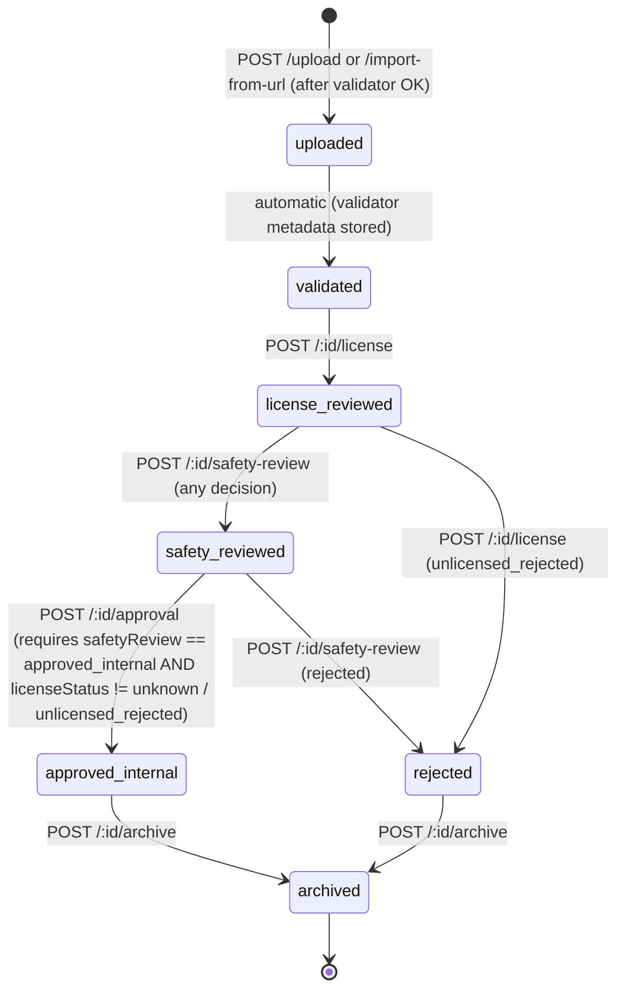
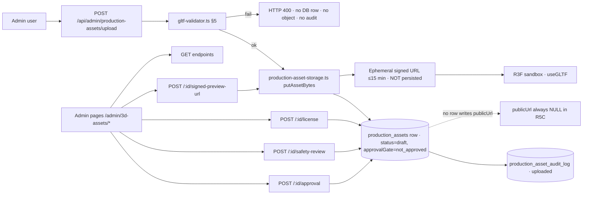

# R5C — Real 3D Asset Library Implementation Plan

**Date:** 2026-05-22
**Phase:** R5C of the R-series R3F / WebGL / Unity integration roadmap
**Prompt source:** founder brief — "Start R5C — Real 3D Asset Library Implementation Plan (plan only)"
**Status:** ✅ DONE — plan only · no code · no schema · no migration · no route · no behavior change
**Maintainer:** root-admin / founder

---

## A. Task title
R5C — Real 3D Asset Library Implementation Plan (plan only)

## B. Date
2026-05-22

## C. Prompt / request summary
Produce the implementation plan for an admin-only, DB-backed catalog of 3D assets (GLB / GLTF) stored in private object storage, with a multi-stage license + safety + approval lifecycle, deterministic GLB / GLTF validator, ephemeral admin-only signed preview URLs, dedicated admin pages, and an extension to the existing R3F sandbox that loads `approvalGate='approved_internal'` assets. No public URLs, no provider calls, no render execution, no live, no Unreal, no 4D hardware, no publishing. **No implementation in this task** — landing only the citable contract that R5C build work (a follow-up task) will execute against.

## D. Goal
Lock the schema columns + default values, REST surface, validator rules, object-storage layout, admin-page inventory, and R3F-sandbox extension shape into a single citable document so the actual R5C build task can be executed predictably and the founder can pre-approve every safety-relevant decision before code lands.

## E. Scope (what is in this task)
- One new plan document: `docs/reports/R3F_REAL_3D_ASSET_LIBRARY_R5C_PLAN.md` (this file)
- One row added to `docs/library/INDEX.md`
- Zero code, zero schema, zero migration, zero route, zero behavior change

## F. Explicit non-goals (R5C plan task)
- ❌ No edit to `shared/schema.ts`
- ❌ No migration / no `drizzle-kit generate` / no `db:push`
- ❌ No new server route, service, middleware, or storage method
- ❌ No new client page or route
- ❌ No upload flow, no URL importer, no validator code
- ❌ No object-storage write or signed-URL minting
- ❌ No edit to `client/src/App.tsx`, `client/src/pages/admin/AdminDashboard.tsx`, or any existing admin/page surface
- ❌ No change to the R5B sandbox component, the `sandbox-cube.glb` asset, or the generator script
- ❌ No provider call (OpenAI / Meshy / Runway / ElevenLabs / HeyGen / Unreal / 4D hardware)
- ❌ No environment-secret read
- ❌ No edit to `replit.md` (the System Architecture mention is a follow-up landed by the build task, not this plan task)

---

# 1. Current baseline (as of 2026-05-22)

| Item | State | Source |
|---|---|---|
| R3F sandbox page | live at `/admin/r3f-preview-sandbox` (admin-only, dry-run, 9 safety badges, demo-GLB toggle) | R5B report |
| R3 sandbox component | `client/src/components/production-house/r3f/ProductionCanvasSandbox.tsx` — accepts `showDemoGltf` + `onGltfError`; loads the local `sandbox-cube.glb` only when toggled | R5B report |
| Committed demo asset | `client/public/demo-assets/sandbox-cube.glb` (1416 B, `internal_only`, generated by `scripts/generate-r3f-demo-glb.mjs`) | R5B report |
| Production-asset DB tables | none — no `production_assets` table exists in `shared/schema.ts` | grep |
| Production-asset REST surface | none | grep |
| Asset library admin page | none | grep |
| Object-storage write / signed-URL minting from any admin page | none | grep |
| Provider calls from sandbox / production house | none | R3 / R5B reports |

R5C plan introduces zero new runtime behavior on top of this baseline. The build task that follows will introduce **two new tables**, one new service module, one new route module, four new admin pages, and one new toggle inside the existing sandbox component — and nothing else.

---

# 2. Schema additions (DESIGN ONLY — to be applied by the build task)

> ⚠️ Nothing in `shared/schema.ts` changes in this plan task. The build task generates exactly one Drizzle migration via `drizzle-kit generate` (no `db:push`).

## 2.A `production_assets`

| Column | Type | Default | Notes |
|---|---|---|---|
| `id` | `uuid` PK | `gen_random_uuid()` | |
| `name` | `text` not null | — | human-readable |
| `format` | `text` not null | — | `glb` or `gltf` |
| `byteSize` | `integer` not null | — | validator output |
| `sha256` | `text` not null **unique** | — | dedup |
| `originalSourceUrl` | `text` nullable | `null` | populated only for URL import |
| `storageKey` | `text` not null | — | relative path under `PRIVATE_OBJECT_DIR` |
| `uploaderUserId` | `text` not null | — | admin id |
| `status` | `text` not null | `'draft'` | `draft` \| `active` \| `archived` |
| `lifecycleState` | `text` not null | `'uploaded'` | `uploaded` \| `validated` \| `license_reviewed` \| `safety_reviewed` \| `approved_internal` \| `rejected` |
| `licenseStatus` | `text` not null | `'unknown'` | `unknown` \| `internal_only` \| `cc0` \| `cc_by` \| `proprietary_licensed` \| `unlicensed_rejected` |
| `licenseSource` | `text` nullable | `null` | free-text source / URL |
| `licenseNote` | `text` nullable | `null` | |
| `safetyReview` | `text` not null | `'pending'` | `pending` \| `approved_internal` \| `rejected` \| `needs_changes` |
| `safetyNote` | `text` nullable | `null` | |
| `approvalGate` | `text` not null | `'not_approved'` | `not_approved` \| `approved_internal` (NEVER `approved_public` in R5C) |
| `publicUrl` | `text` | `null` | **CHECK constraint: must be NULL in R5C.** Column exists for forward-compat; lifted only in a later phase (R5D or later). |
| `metadata` | `jsonb` nullable | `null` | validator output (vertex/index/accessor counts, bounds, etc.) |
| `createdAt` | `timestamptz` | `now()` | |
| `updatedAt` | `timestamptz` | `now()` | |

Indexes:
- `unique(sha256)` — dedup
- `index(status)` · `index(safetyReview)` · `index(approvalGate)` — list filtering
- `index(createdAt)` — pagination ordering

CHECK constraint name: `production_assets_public_url_must_be_null_in_r5c` → `publicUrl IS NULL`. Dropped in a later phase when the public flow ships.

## 2.B `production_asset_audit_log`

| Column | Type | Notes |
|---|---|---|
| `id` | `uuid` PK | |
| `assetId` | `uuid` FK → `production_assets.id` not null **indexed** | |
| `actorUserId` | `text` not null | admin id |
| `event` | `text` not null | `uploaded` \| `imported` \| `validated` \| `validation_failed` \| `license_set` \| `safety_decided` \| `approval_advanced` \| `signed_url_issued` \| `archived` |
| `payload` | `jsonb` nullable | event-specific extras (validator metadata, signed-URL TTL + adminUserId, license/safety inputs, etc.) |
| `createdAt` | `timestamptz` default `now()` | |

Indexes: `index(assetId, createdAt)` · `index(event)`.

## 2.C Insert schemas and types
For each table the build task adds, alongside the table:
- `insertProductionAssetSchema = createInsertSchema(productionAssets).omit({ id: true, createdAt: true, updatedAt: true })`
- `type InsertProductionAsset = z.infer<typeof insertProductionAssetSchema>`
- `type ProductionAsset = typeof productionAssets.$inferSelect`
- Same triple for `productionAssetAuditLog` (omit `id`, `createdAt`).

## 2.D Safest defaults (non-negotiable)

| Field | Default |
|---|---|
| `status` | `draft` |
| `lifecycleState` | `uploaded` |
| `licenseStatus` | `unknown` |
| `safetyReview` | `pending` |
| `approvalGate` | `not_approved` |
| `publicUrl` | `null` |
| `metadata` | `null` |

The build task enforces these defaults at three layers: Drizzle column defaults, Zod insert schemas, and an explicit assertion inside `createAsset` (defense-in-depth).

---

# 3. Storage layer (`IStorage` additions)

The build task extends `IStorage` in `server/storage.ts` with the methods below. Every method validates inputs with the Zod schema defined in §2.C and returns the Drizzle row type. All writes happen in a `db.transaction(...)` block so the asset row + the matching `production_asset_audit_log` entry land atomically.

| Method | Signature (informal) | Audit event written atomically |
|---|---|---|
| `createAsset` | `(input: InsertProductionAsset, audit: { actorUserId, payload? }) → Promise<ProductionAsset>` | `uploaded` or `imported` (selected by caller) |
| `getAssetById` | `(id: string) → Promise<ProductionAsset \| undefined>` | none |
| `getAssetBySha256` | `(sha256: string) → Promise<ProductionAsset \| undefined>` | none (dedup probe) |
| `listAssets` | `({ status?, safetyReview?, approvalGate?, limit, offset }) → Promise<{ items: ProductionAsset[]; total: number }>` | none |
| `updateAssetLicense` | `(id, { licenseStatus, licenseSource, licenseNote, actorUserId }) → Promise<ProductionAsset>` | `license_set` |
| `updateAssetSafetyReview` | `(id, { safetyReview, safetyNote, actorUserId }) → Promise<ProductionAsset>` | `safety_decided` |
| `advanceAssetApprovalGate` | `(id, { actorUserId }) → Promise<ProductionAsset>` | `approval_advanced` — refuses any transition other than `not_approved → approved_internal`; returns 409-style error otherwise. |
| `archiveAsset` | `(id, { actorUserId, reason? }) → Promise<ProductionAsset>` | `archived` (sets `status='archived'`) |
| `appendAuditLog` | `({ assetId, actorUserId, event, payload? }) → Promise<ProductionAssetAuditLog>` | the event itself (used by routes that don't already write inside the helpers above, e.g. `signed_url_issued`) |
| `listAuditLogForAsset` | `(assetId, { limit }) → Promise<ProductionAssetAuditLog[]>` | none |

Forbidden surface (must not exist): any setter that touches `publicUrl`. Build task enforces this by deliberately omitting the column from `updateAssetLicense` / `updateAssetSafetyReview` / `advanceAssetApprovalGate` and by leaving no exported helper that updates it.

---

# 4. Object-storage service

New module: `server/services/production-asset-storage.ts`. Thin wrapper around the existing `javascript_object_storage` integration. Three methods only:

| Method | Behavior |
|---|---|
| `putAssetBytes(storageKey: string, buffer: Buffer): Promise<void>` | Writes to `PRIVATE_OBJECT_DIR/production-assets/{storageKey}`. **Throws** if `storageKey` does not match `^production-assets/[a-f0-9-]+\.(glb\|gltf)$`. **Throws** if the resolved key would land anywhere in the public search path. |
| `headAsset(storageKey: string): Promise<{ exists: boolean; byteSize?: number }>` | Existence + size probe for verification after upload. |
| `issueSignedPreviewUrl(storageKey, { adminUserId, ttlSeconds }): Promise<{ url: string; expiresAt: Date }>` | TTL clamped to `Math.min(900, ttlSeconds)`. Returns ephemeral URL; **never persisted in the DB.** Caller (route) appends a `signed_url_issued` audit row with `{ adminUserId, ttlSeconds, expiresAt }` in the payload (URL itself is **not** logged — only the fact it was issued). |

No method takes a `publicUrl` argument. No method writes outside `PRIVATE_OBJECT_DIR/production-assets/`. Failure to honor either invariant is a test failure.

---

# 5. Deterministic GLB / GLTF validator

New module: `server/services/gltf-validator.ts`. Synchronous, no third-party render dependency, no fetch.

## 5.A Function shape
```ts
type ValidatorOk = { ok: true; metadata: ValidatorMetadata };
type ValidatorFail = { ok: false; reason: string };
function validateGlbOrGltf(buffer: Buffer, opts?: ValidatorOptions): ValidatorOk | ValidatorFail;
```

Never throws. Returns the discriminated union above.

## 5.B Checks (all must pass)

| # | Check | Failure reason string (stable) |
|---|---|---|
| 1 | GLB magic header `0x46546C67` (little-endian `glTF`) | `glb_bad_magic` |
| 2 | GLB version `2` | `glb_bad_version` |
| 3 | GLB total length matches `buffer.byteLength` | `glb_length_mismatch` |
| 4 | JSON chunk type `0x4E4F534A`, length within bounds, parses as JSON | `glb_json_chunk_invalid` |
| 5 | Optional BIN chunk type `0x004E4942`, length consistent with `json.buffers[0].byteLength` | `glb_bin_chunk_inconsistent` |
| 6 | `asset.version === '2.0'` | `gltf_version_unsupported` |
| 7 | `nodes.length ≤ 200`, `meshes.length ≤ 200`, `accessors.length ≤ 2000`, `bufferViews.length ≤ 2000` (caps configurable via `opts`) | `gltf_complexity_cap_exceeded` |
| 8 | Total `byteSize ≤ 25 MB` (configurable via `opts`) | `gltf_size_cap_exceeded` |
| 9 | `extensionsRequired` is empty (R5C allow-list: empty) | `gltf_extension_required_disallowed` |
| 10 | No `images` referencing external URIs (`uri` must be a `data:` URI or absent in favour of a `bufferView`) | `gltf_external_image_uri_disallowed` |

Validator runs **before** any DB row is created and **before** any byte is persisted to object storage. On `{ok: false}` the upload route returns HTTP 400 with `{ ok: false, reason }` and **no audit row, no DB row, no object** is written. (`validation_failed` is reserved for future flows that may want to record post-creation re-validation; the upload-time failure is observable only via the HTTP response, consistent with §1 of the brief.)

## 5.C Metadata returned on success
```jsonc
{
  "format": "glb",            // or "gltf"
  "byteSize": 12345,
  "vertexCount": 24,
  "indexCount": 36,
  "accessorCount": 3,
  "bufferViewCount": 3,
  "nodeCount": 1,
  "meshCount": 1,
  "bounds": { "min": [-0.5,-0.5,-0.5], "max": [0.5,0.5,0.5] },
  "validatorVersion": "r5c-1"
}
```

Stored verbatim in `production_assets.metadata`.

---

# 6. REST surface

New route module: `server/routes/admin/production-assets.ts`, registered from `server/routes.ts` via a single `registerProductionAssetRoutes(app)` call (matches existing route-module pattern, e.g. `registerBroadcastRoutes`). Every endpoint:
- Sits under `/api/admin/production-assets`.
- Goes through `requireAdmin` middleware (same as the rest of the admin surface).
- Returns **403** to any non-admin caller — never leaks asset existence.
- Never returns `publicUrl` (always serialized as `null`).
- Wraps mutating writes in a single DB transaction that also appends the audit row.

| Method | Path | Body / Query | Auth | Audit |
|---|---|---|---|---|
| `POST` | `/upload` | multipart form: `file` (≤25 MB), `name`, `licenseHint?`, `licenseSource?` | admin | `uploaded` |
| `POST` | `/import-from-url` | JSON: `{ url: https://…, name, licenseHint?, licenseSource? }` | admin | `imported` (records `originalSourceUrl` in metadata payload) |
| `GET` | `/` | `?status=&safetyReview=&approvalGate=&limit=&offset=` | admin | none |
| `GET` | `/:id` | — | admin | none (returns asset + last 20 audit-log rows) |
| `POST` | `/:id/signed-preview-url` | JSON: `{ ttlSeconds?: number ≤900 }` | admin | `signed_url_issued` |
| `POST` | `/:id/safety-review` | JSON: `{ decision: 'approved_internal'\|'rejected'\|'needs_changes', note? }` | admin | `safety_decided` |
| `POST` | `/:id/license` | JSON: `{ licenseStatus, licenseSource?, licenseNote? }` | admin | `license_set` |
| `POST` | `/:id/approval` | JSON: `{ }` (transitions `not_approved → approved_internal` only) | admin | `approval_advanced` |
| `POST` | `/:id/archive` | JSON: `{ reason? }` | admin | `archived` |

Hard rule: there is **no** route that sets `publicUrl`, advances `approvalGate` past `approved_internal`, or returns a non-ephemeral preview URL.

Multipart parsing uses the existing `multer` dependency (already imported in `server/routes.ts`). URL import uses a server-side `fetch` with a 30-second timeout, `https:` only, `Content-Length ≤ 25 MB` precheck, and content-type allow-list (`model/gltf-binary`, `model/gltf+json`, `application/octet-stream`).

---

# 7. Admin pages (frontend)

Four new lazy-loaded pages under `client/src/pages/admin/3d-assets/`. Each page:
- Uses the standard admin shell (matches `R3FPreviewSandbox.tsx` styling).
- Uses `@tanstack/react-query` for fetching.
- Renders the same admin-only safety-badge style as the R3F sandbox.
- Tags every interactive element with `data-testid` per the stack convention.

| Page | Path | Purpose | Key `data-testid`s |
|---|---|---|---|
| `AssetLibraryList.tsx` | `/admin/3d-assets` | Paginated list with `status` / `safetyReview` / `approvalGate` filters; link to detail | `page-3d-assets-list`, `filter-status`, `filter-safety-review`, `filter-approval-gate`, `row-asset-${id}`, `link-asset-detail-${id}` |
| `AssetUpload.tsx` | `/admin/3d-assets/upload` | File picker + import-from-URL form; surfaces validator feedback | `page-3d-assets-upload`, `input-file`, `input-url`, `button-upload`, `button-import-url`, `text-validator-feedback` |
| `AssetDetail.tsx` | `/admin/3d-assets/:id` | Metadata, lifecycle pills, audit-log tail (last 20), "Issue signed preview URL" button (single-use, shows TTL countdown) | `page-3d-assets-detail`, `text-asset-name`, `pill-lifecycle-state`, `pill-license-status`, `pill-safety-review`, `pill-approval-gate`, `button-issue-signed-url`, `text-signed-url-expires`, `row-audit-${id}` |
| `AssetSafetyReview.tsx` | `/admin/3d-assets/:id/safety-review` | License fields, safety checklist, decision form | `page-3d-assets-safety-review`, `select-license-status`, `input-license-source`, `input-license-note`, `radio-decision-${value}`, `input-safety-note`, `button-submit-safety-review` |

Safety badges shown on every page (identical to R3F sandbox): `Admin only`, `No public URL`, `No signed URL persisted`, `No provider calls`, `No render execution`, `No publishing`. New badge introduced by R5C and shown on the sandbox once R5C ships: `Approved internal only` (rendered next to the new asset-picker toggle described in §8).

Pages are registered as lazy routes in `client/src/App.tsx` in a single contiguous block. **No other route is added or modified.** One new card is added in `AdminDashboard.tsx` under the existing 3D / 4D / Unreal zone, linking to `/admin/3d-assets`. No other dashboard card is added or modified.

---

# 8. R3F sandbox extension

The build task extends `client/src/components/production-house/r3f/ProductionCanvasSandbox.tsx` and `client/src/pages/admin/R3FPreviewSandbox.tsx` to add **one** new toggle: `Load approved internal asset`. The toggle defaults OFF. When ON:
1. The page calls `GET /api/admin/production-assets?approvalGate=approved_internal&status=active&limit=50` and renders the result in a dropdown.
2. On select, the page calls `POST /api/admin/production-assets/:id/signed-preview-url` with `{ ttlSeconds: 900 }`.
3. The signed URL is passed to `useGLTF` inside the existing `Suspense + ErrorBoundary + WebGL-fallback` stack. The URL is held only in component state and disappears on unmount or when the toggle flips OFF.
4. If the URL TTL elapses while the asset is loaded, the next interaction re-mints; the URL is **never** persisted in localStorage / sessionStorage / cookies.

The R5B `Load demo GLB` toggle stays unchanged. Both toggles are independent; both default OFF. The new safety badge `Approved internal only` is rendered alongside the existing 9 R5B badges only when the new toggle is ON.

ErrorBoundary, Suspense fallback, and the WebGL-availability fallback are reused **unchanged** from R5B.

---

# 9. Hard safety invariants (must hold for every R5C surface)

| Invariant | Enforcement |
|---|---|
| `publicUrl` is always `null` in R5C | Drizzle column default + CHECK constraint + omission from every setter + always serialized as `null` by every route |
| Signed URLs are never persisted | The DB has no signed-URL column; the service returns ephemeral URLs; the audit log records `{ adminUserId, ttlSeconds, expiresAt }` only (URL itself excluded) |
| `realSendAllowed = false` · `executionEnabled = false` | No surface in R5C reads either of those flags; render / publish remain off |
| No render execution / no live / no Unity / no Unreal / no 4D hardware / no publishing | No new route, no new service, no new client surface touches any of those pipelines |
| No provider call | Validator is local-only; URL import uses raw `fetch`; no OpenAI / Meshy / Runway / HeyGen / ElevenLabs client constructed anywhere in the R5C code |
| No webhook / no public endpoint | All routes under `/api/admin/…`, all protected by `requireAdmin` |
| No public-bucket write | `production-asset-storage.ts` refuses any write outside `PRIVATE_OBJECT_DIR/production-assets/` |
| Approval gate one-way | `approvalGate` advances `not_approved → approved_internal` only; no setter exists for `approved_public` |
| Validator caps default to ≤25 MB / ≤200 nodes / ≤200 meshes / ≤2000 accessors / ≤2000 bufferViews | `gltf-validator.ts` defaults; configurable via `opts` for tests only |
| No edit to R5B `sandbox-cube.glb` or `scripts/generate-r3f-demo-glb.mjs` | Build task does not touch either file |

---

# 10. Lifecycle state machine (Mermaid)



**Terminal states:** `approved_internal` (re-enterable into `archived` only) · `rejected` (re-enterable into `archived` only) · `archived` (terminal).

**Forbidden in R5C:** any state transitioning to `approved_public`. The column value `approved_public` does not appear anywhere in R5C code; it is reserved for a later phase.

---

# 11. Object-storage layout (R5C-only)

```
PRIVATE_OBJECT_DIR/
  production-assets/
    {assetId}.glb                # canonical binary for both glb and gltf uploads (gltf is re-packaged at upload time? — NO: stored verbatim; suffix tracks format)
    {assetId}.gltf
```

- One file per asset row. `storageKey` column equals `production-assets/{assetId}.{glb|gltf}`.
- No subdirectories per asset; no preview thumbnails (out of scope per brief §0).
- Signed URLs always reference the exact `storageKey`; the integration's signing helper handles bucket resolution.
- **Nothing is ever written under `PUBLIC_OBJECT_SEARCH_PATHS`.** The storage service throws when asked to.

---

# 12. Data flow (Mermaid)



---

# 13. Test plan (informal — to be executed by the build task)

| # | Layer | Check |
|---|---|---|
| 1 | Build | `npm run build` passes |
| 2 | TS | `npx tsc --noEmit -p tsconfig.json` — zero new diagnostics on R5C files |
| 3 | Migration | One new migration file under `migrations/`; applies cleanly on a fresh DB; tables match §2 |
| 4 | Validator unit | GLB header / chunk / version / caps / extensions / external-URI checks; all 10 failure-reason strings reachable |
| 5 | Validator unit | Happy path against the existing `sandbox-cube.glb` returns `{ ok: true }` with non-empty metadata |
| 6 | Storage service unit | `putAssetBytes` rejects non-conforming `storageKey`; `issueSignedPreviewUrl` clamps TTL to 900 |
| 7 | Route smoke | Non-admin caller receives 403 on every R5C endpoint |
| 8 | Route smoke | Upload of a 0-byte file → 400 (`glb_bad_magic`); no DB row, no object |
| 9 | Route smoke | Upload of `sandbox-cube.glb` → 201, row created with safe defaults, audit row appended |
| 10 | Route smoke | `POST /:id/approval` refuses to advance when `safetyReview != approved_internal` |
| 11 | Route smoke | Response payloads never include a non-`null` `publicUrl` |
| 12 | Manual | `/admin/3d-assets`, `/admin/3d-assets/upload`, `/admin/3d-assets/:id`, `/admin/3d-assets/:id/safety-review` all load |
| 13 | Manual | Existing `/admin/r3f-preview-sandbox` still loads with both toggles OFF; demo-GLB toggle still works |
| 14 | Manual | New sandbox toggle loads an approved-internal asset via signed URL |
| 15 | Verification | `git diff --stat HEAD -- server/services/` shows only the two new services; `git diff --stat HEAD -- shared/` shows only the two new tables; `git diff --stat HEAD -- client/src/App.tsx client/src/pages/admin/AdminDashboard.tsx` shows only one block / one card |

---

# 14. Rollback plan (for the future build task)

```bash
# 1. Revert the merge commit, OR manually:
git checkout HEAD~1 -- \
  shared/schema.ts \
  server/storage.ts \
  server/routes.ts \
  client/src/App.tsx \
  client/src/pages/admin/AdminDashboard.tsx \
  client/src/components/production-house/r3f/ProductionCanvasSandbox.tsx \
  client/src/pages/admin/R3FPreviewSandbox.tsx
rm -r \
  server/routes/admin/production-assets.ts \
  server/services/production-asset-storage.ts \
  server/services/gltf-validator.ts \
  client/src/pages/admin/3d-assets
# 2. Drop the migration:
#    Roll back the latest migration via the project's migration runner.
# 3. Verify
npm run build
```

The R5B sandbox + demo asset + generator script survive rollback unchanged.

---

# 15. Out of scope (R5C — restated for the build task)

- Public publishing of any asset
- `approved_public` approval gate (R5D or later)
- Newsroom / podcast / debate room integration of any asset (separate task that depends on R5C)
- Render execution, Remotion compositing, Unity, Unreal, 4D hardware, live broadcast
- Provider API calls (Meshy text-to-3D, Runway, HeyGen, etc.) and any generation flow
- Public end-user upload of assets (admin/founder only in R5C)
- Bulk import / migration of any existing files
- Auto-tagging, AI metadata enrichment, automated safety classification
- Asset versioning / replacement / rollback
- Texture/material extraction, thumbnail generation pipeline (a single static "GLB" badge suffices)
- Any change to the R5B `sandbox-cube.glb` asset or its generator script
- `replit.md` System-Architecture mention (lands with the build task, not this plan task)

---

# 16. Risks

| Risk | Likelihood | Mitigation |
|---|---|---|
| Migration applied accidentally before build task lands | low | Plan task makes **no** schema or migration change; build task is a separate, founder-approved step |
| Validator caps too restrictive for legitimate near-future assets | medium | Caps are configurable via `opts`; build task surfaces them as constants in `gltf-validator.ts` so a future PR can tune them with audit visibility |
| Signed-URL TTL exposing approved-internal assets too long | low | TTL is clamped server-side to 900 s; `signed_url_issued` audit captures every issuance for forensic review |
| `publicUrl` CHECK constraint blocking a forward-compat migration later | low | CHECK has an explicit, citable name (`production_assets_public_url_must_be_null_in_r5c`); the future R5D task drops the constraint as its first migration step |
| Upload race between two admins on the same `sha256` | low | `unique(sha256)` index returns a deterministic DB error; the route maps it to HTTP 409 with a `{ existingAssetId }` body |
| `extensionsRequired` allow-list staying empty rejects future legitimate GLBs | low | Reject is the safe default; broadening the allow-list is a one-line change in the validator under audit |

---

# 17. Archive / library references checked

| Source | Finding |
|---|---|
| `docs/reports/R3F_ASSET_METADATA_SAFETY_MODEL_R4_DESIGN.md` | R4 already designed the broader asset model (more assetTypes, scene packages, approval-public flow). R5C deliberately implements a strict subset: GLB/GLTF only, no scene packages, no `approved_public`. Forward-compatible with R4 — every R5C column maps to an R4 §3.A column without renames. |
| `docs/reports/R3F_STATIC_GLB_DEMO_LOADER_R5B_REPORT.md` §R | R5B explicitly proposed R6 as "schema-first implementation of `production_assets` + `production_asset_audit_log`". R5C executes that recommendation as the build task; this plan task lays the contract. |
| `docs/reports/R3F_PREVIEW_SANDBOX_R3_REPORT.md` | Confirmed R3 sandbox component shape; R5C reuses Suspense + ErrorBoundary + WebGL-fallback unchanged. |
| `docs/archive/ARCHIVE_LIBRARY_INDEX.md` | No prior `production_assets` table, no prior asset-library admin page, no prior validator. Greenfield within the production-house cluster. |
| `replit.md` Archive Library policy | Honored — checked archive before designing greenfield. |
| `docs/DEVELOPMENT_DOCUMENTATION_POLICY.md` | This plan follows the 20-field A–T policy. |

**Archive-first cost rule satisfied.**

---

# 18. Open questions for the founder (to resolve before build task starts)

1. **License-status enum** — current draft uses `unknown` / `internal_only` / `cc0` / `cc_by` / `proprietary_licensed` / `unlicensed_rejected`. Add `cc_by_sa`, `cc_by_nc`? (Default: NO for R5C — keep minimal; widen later.)
2. **Validator size cap** — defaults to 25 MB. Acceptable, or want 50 MB? (Default: 25 MB — safest.)
3. **Validator complexity caps** — 200 nodes / 200 meshes / 2000 accessors / 2000 bufferViews. Acceptable? (Default: these caps comfortably cover the R5B `sandbox-cube.glb` and typical newsroom-prop GLBs.)
4. **Signed-URL TTL ceiling** — 900 s (15 min) hard cap. Tighter? (Default: 15 min, matches R4 §7.C.)
5. **`gltf` vs `glb` only `glb`** — brief explicitly allows both. Confirm both should be accepted, or restrict R5C to `glb` only to avoid multi-file `gltf` dependency resolution? (Default in this plan: accept both, but treat `gltf` as the single JSON file only — no dependent resource resolution; reject any `gltf` with non-data-URI external refs via §5 check 10.)
6. **Approval-gate writer auth** — `requireAdmin` (any admin) sufficient, or require `requireRootAdmin` for the `approval_advanced` transition? (Default in this plan: any admin, matching the rest of R5C; trivially upgradable to root-admin in the build task.)

The build task should not start until these are answered (or the defaults explicitly accepted).

---

# 19. Recommendation

Approve the plan as written (with default answers to §18) and queue the R5C **build task** as a single follow-up that executes §2 through §8 strictly in order, with §13 as the verification gate before merge. The build task is sized for one focused session: ~2 new server modules (storage service + validator), 1 new route module, 4 new client pages, 1 schema migration, 1 sandbox-component diff, 1 app-routes diff, 1 dashboard-card diff, 1 execution report.

---

# 20. Confirmation — source behavior change in *this* plan task

| Surface | Change |
|---|---|
| `shared/schema.ts` | **NONE** |
| `migrations/` | **NONE** |
| `server/` | **NONE** |
| `client/src/App.tsx` | **NONE** |
| `client/src/pages/admin/AdminDashboard.tsx` | **NONE** |
| `client/src/components/production-house/r3f/ProductionCanvasSandbox.tsx` | **NONE** |
| `client/src/pages/admin/R3FPreviewSandbox.tsx` | **NONE** |
| `client/public/demo-assets/*` | **NONE** |
| `scripts/generate-r3f-demo-glb.mjs` | **NONE** |
| `replit.md` | **NONE** |
| `docs/library/INDEX.md` | +1 row (this plan) |
| `docs/reports/` | +1 file (this plan) |
| Workflows | not restarted |
| Tests | not added, not modified |
| Environment / secrets | none read |

**Net runtime behavior change: zero.** This task only writes the citable contract; the build task that follows will execute it under separate founder approval.
