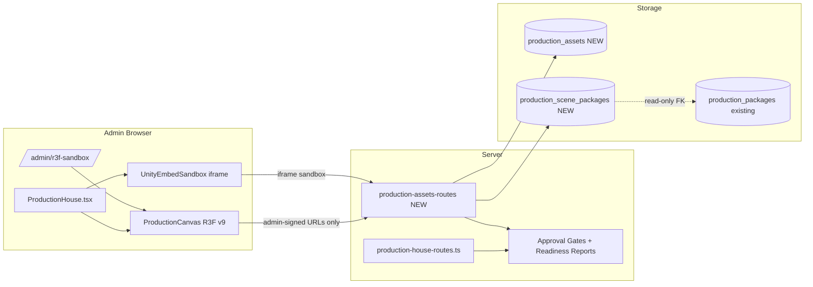
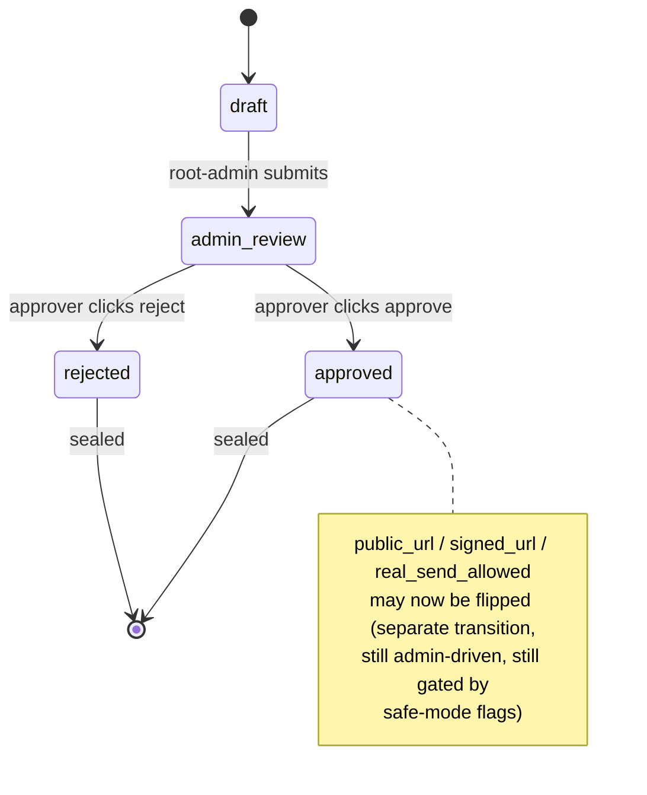
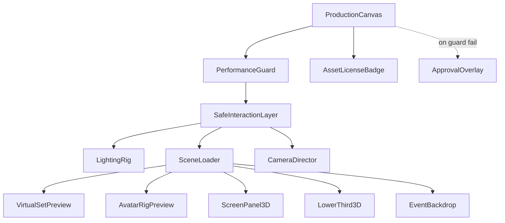
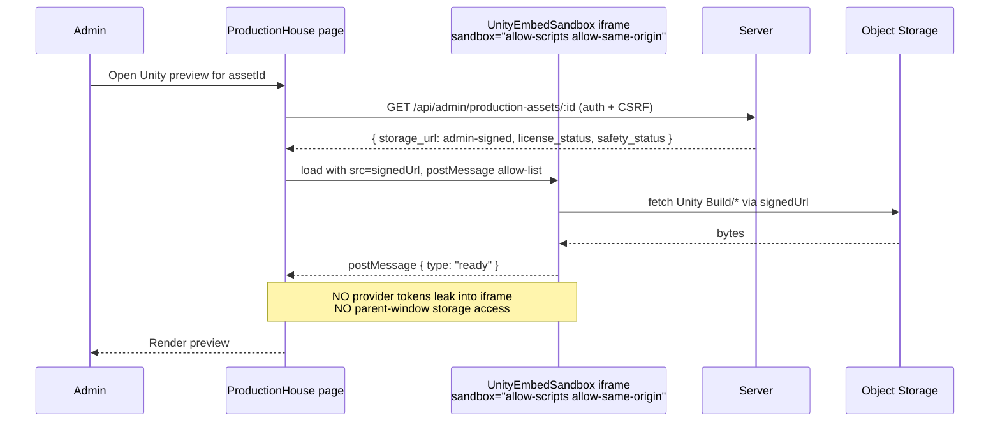
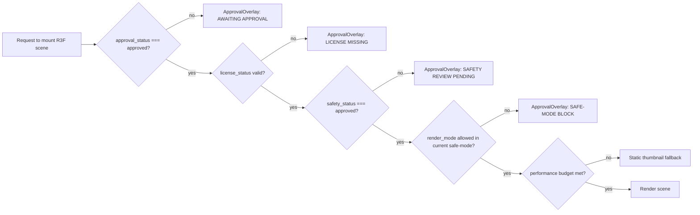

# R1 — R3F / WebGL / Unity Production House Integration Design

**Date:** 2026-05-22
**Status:** DESIGN ONLY — no packages installed, no code changed, no routes created, no schemas changed, no real rendering / live execution / Unreal / Cinema 4D / Unity build / 4D-hardware enabled.
**Reference docs:** React Three Fiber v9 docs (pmnd.rs) §getting-started, §api/{canvas,objects,hooks,events,additional-exports,typescript,testing}, §advanced/{scaling-performance,pitfalls}, §tutorials/{v9-migration-guide,events-and-interaction,loading-models,loading-textures,basic-animations,how-it-works}, §community-r3f-components.

---

## 1. Current app compatibility

| Dimension | Current value | R3F implication |
|---|---|---|
| `react` | **19.2.3** (`package.json: "^19.2.0"`) | **R3F v9 required.** Per R3F docs: v9 pairs with React 19; v8 pairs with React 18. v8 is **incompatible** with this codebase. |
| `react-dom` | 19.2.3 | Same — v9 required. |
| `vite` | **7.3.1** (`package.json: "^7.1.9"`) | Fully compatible with R3F v9 (R3F docs reference Vite/CRA/Next; no version pin). |
| `typescript` | **5.6.3** | Compatible — R3F v9 ships first-party `.d.ts` (per §api/typescript). |
| `three` | **already installed: `^0.183.0`** | Compatible with R3F v9 (R3F v9 supports three ≥0.156). **This is a key finding — three.js is already a dep, so R3F v9 only adds the React renderer layer.** |
| `@react-three/fiber` | **not installed** | Install candidate (R2). |
| `@react-three/drei` | **not installed** | Recommended companion (R2). |
| `@react-three/test-renderer` | **not installed** | Recommended for §api/testing (R10). |
| Vite plugins | `@vitejs/plugin-react`, `@tailwindcss/vite`, `metaImagesPlugin`, `@replit/vite-plugin-runtime-error-modal`, dev-only cartographer + dev-banner | All compatible. **No additional Vite plugin required for R3F** — R3F works inside the standard React plugin pipeline. |
| `tsconfig.json` | `target: ES2020`, `module: ESNext`, `moduleResolution: bundler`, `jsx: react-jsx`, `strict: true` | Fully compatible with R3F v9 typings. |
| Admin page registry | 79 admin pages; Production House lives at `client/src/pages/admin/ProductionHouse.tsx` + `PreviewStudioHero.tsx` companion | Integration point is `ProductionHouse.tsx` and (later) a new sandbox page. |
| Existing 3D code | **none** — `rg "three|@react-three|webgl|Unity|R3F" client/` returns 0 hits | Greenfield integration; no migration risk. |

### 1.1 Recommended R3F version (no install in R1)

| Package | Recommended version | Reason |
|---|---|---|
| `@react-three/fiber` | **`^9.x` (latest 9.x)** | React 19 compatibility |
| `@react-three/drei` | **latest 10.x or whichever majors track R3F v9** | Standard helper set; align with the R3F v9 docs |
| `@react-three/test-renderer` | **latest 9.x matching `@react-three/fiber@9`** | Per §api/testing |
| `three` | **keep existing `^0.183.0`** | Already in `package.json`; no upgrade required |
| (Optional, later) `leva` for admin debug knobs | latest | Only inside admin sandbox pages |

**Install command (do NOT run in R1):**
```bash
# Defer to R2. Listed here only so R2 has an exact starting command.
npm install @react-three/fiber@^9 @react-three/drei
npm install -D @react-three/test-renderer@^9
```

### 1.2 v9 migration concerns (per §tutorials/v9-migration-guide)
- v9 removed the auto-installation of `THREE.ColorManagement.legacyMode = true`. Pages embedding R3F must explicitly set the color-space they expect. **Recommendation:** standardize on `THREE.SRGBColorSpace` for the admin-preview Canvas via a shared `<ProductionCanvas/>` wrapper (see §6).
- v9 removed `attachArray` / `attachObject`. New code only — no migration cost for us.
- Event-system overhaul (per §api/events): camera-ray pointer events now flow through `domElement` rather than the wrapper div. Important for our `SafeInteractionLayer` (see §6).
- v9 supports concurrent React 19 features. We can safely use `<Suspense>`-driven asset loading (§tutorials/loading-models, §loading-textures).

---

## 2. Architecture — where R3F fits

```
┌─────────────────────────────── client/src/pages/admin ──────────────────────────────┐
│                                                                                      │
│   ProductionHouse.tsx ─────────┬─► <ProductionCanvas/> (R3F v9)                     │
│                                ├─► <PackagePreviewSlot/>                            │
│                                └─► <UnityEmbedSandbox/> (iframe, sandboxed)         │
│                                                                                      │
│   PreviewStudioHero.tsx ───────► already-existing 2D preview surface (unchanged)    │
│                                                                                      │
│   NeuralNewsroom.tsx ──────────► future: <NewsroomSet/> 3D set preview              │
│   PodcastScripts.tsx ──────────► future: <PodcastRoomSet/>                          │
│   LiveDebateStudio.tsx ────────► future: <DebateRoomSet/>                           │
│   CinemaControl.tsx (4D) ──────► future: <EventBackdrop/> dry-run only              │
│   AnchorModePicker.tsx ────────► future: <AvatarRigPreview/>                        │
│                                                                                      │
│   NEW R1-proposed sandbox: /admin/r3f-sandbox  (admin-only, not surfaced in zones   │
│                                                  until R3 is built)                  │
│                                                                                      │
└─────────────────────────────────────────────────────────────────────────────────────┘
```

**Integration principles (carried from T1–T5 + C1):**
1. R3F lives **only inside admin pages** in R1's scope. No public-facing Canvas in this design.
2. R3F never calls a provider API. All asset URLs come from server routes that already enforce approval gates.
3. R3F is **lazy-loaded** per page (dynamic `import()` of the Canvas wrapper), so admin pages without 3D content don't pay the bundle cost.
4. R3F sits **after** the existing approval gates — it cannot bypass the dry-run/manual/safe-mode flags from `replit.md` (Founder Panic Button, Platform Stability Triangle, Production House readiness reports).

---

## 3. Rendering modes

| Mode | Audience | Asset access | Public URL? | Provider calls? | Notes |
|---|---|---|---|---|---|
| `browser_preview` | Admin browser only | Unsigned admin URLs | ❌ | ❌ | Default mode for sandbox |
| `admin_only_preview` | Authenticated admin/root | Admin-signed URLs (server-issued, short TTL) | ❌ | ❌ | Inside Production House page |
| `public_safe_preview` | Public viewers (future) | **Only licensed + approved + watermarked** assets | ✅ but watermark | ❌ | **Not enabled in R1.** Schema accommodates it. |
| `production_package_preview` | Admin review | Snapshot of the Production House `production_package` row | ❌ | ❌ | Read-only render of an approved package's scene plan |
| `dry_run_render_plan` | Admin review | Symbolic render — outputs a JSON plan, never a video | ❌ | ❌ | Reuses existing dry-run guard from `replit.md` |
| `unity_webgl_embed` | Admin/root | Iframe `sandbox="allow-scripts allow-same-origin"` — Unity build hosted from same origin | ❌ | ❌ | Sandboxed iframe; Unity build cannot reach Mougle APIs |
| `3d_asset_inspection` | Admin | Single GLB/GLTF, no scene composition | ❌ | ❌ | For asset triage |
| `avatar_animation_preview` | Admin/root | Avatar rig + idle/talk loop | ❌ | ❌ | No real TTS playback in R1 |
| `virtual_set_preview` | Admin/root | A `sceneType` (newsroom/podcast/debate/event) loaded with locked camera | ❌ | ❌ | Sister of `production_package_preview` |

**Hard rule:** every mode defaults to `publicUrl: null`, `signedUrl: null`, `realSendAllowed: false`, `executionEnabled: false`. Only an explicit admin approval transition can flip these — and even then, only `signedUrl` for `production_package_preview` and `publicUrl` for `public_safe_preview` (the latter not enabled in R1).

---

## 4. Asset type support

| Asset class | Format | Loader (R3F v9) | License gate | Notes |
|---|---|---|---|---|
| 3D model | GLB / GLTF | `useGLTF` from `@react-three/drei` (wraps `GLTFLoader`); §tutorials/loading-models | Required | Draco / Meshopt compression supported |
| Texture | PNG/JPEG/WebP/KTX2 | `useTexture` from drei; §tutorials/loading-textures | Required | KTX2 preferred for size |
| HDRI / env map | `.hdr`, `.exr` | `useEnvironment` (drei) | Required | Polyhaven license must be captured in `licenseStatus` |
| Avatar rig | GLB w/ skeleton + morph targets | `useGLTF` + `<SkeletonHelper/>` for debug | Required | No real lip-sync in R1; pre-baked idle loops only |
| Newsroom set model | GLB | `<NewsroomSet/>` wrapper | Required | Static set; camera director chooses framings |
| Podcast room model | GLB | `<PodcastRoomSet/>` | Required | Same shape |
| Debate room model | GLB | `<DebateRoomSet/>` | Required | Same shape |
| Props | GLB | per-prop component or `<group>` of `useGLTF` | Required | Reused across sets — use `<Instances>` from drei |
| Screen panel | Plane mesh + texture | `<ScreenPanel3D/>` | Approval-only content | Surface texture = current `screen-take-plan` output (read-only) |
| Lower third / overlay | Plane mesh + canvas texture OR HTML `<Html>` from drei | `<LowerThird3D/>` | Approval-only | No autonomous text generation in R1 |
| Unity WebGL build | Unity-generated `Build/*.{loader.js,data,framework.js,wasm}` | Iframe `<UnityEmbedSandbox/>` — NOT inside R3F Canvas | Required | Sandboxed iframe; Unity → Mougle postMessage is read-only |
| Cinema 4D exports | GLB only (no `.c4d` native) | Same as GLB | Required | C4D project files must be pre-baked offline and uploaded as GLB |
| Meshy-generated | GLB | Same as GLB | Required + AI-generation provenance | Provenance field in `licenseStatus` |
| Runway-generated background video | MP4 / WebM | HTML `<video>` element mapped to a R3F texture via `useVideoTexture` (drei) | Required + AI-generation provenance | Used only as background plates, never as final output |

---

## 5. Data model proposal (planning only — no schema written)

**Two NEW tables proposed; ZERO existing-table modification.** (Same posture as D1 design §J.3.)

### 5.1 `production_assets` (NEW)

```
production_assets {
  id                  serial PK
  asset_id            text  unique   -- stable external id (uuid)
  display_name        text
  asset_type          text  CHECK IN (
                        'glb','gltf','texture','hdri',
                        'avatar_rig','set_model','prop',
                        'screen_panel','lower_third',
                        'unity_webgl_build','video_plate'
                      )
  storage_url         text   -- internal storage path; NEVER served publicly
  size_bytes          integer
  source_provider     text   -- 'meshy','runway','manual_upload','c4d_export', ...
  license_status      jsonb  -- { kind, holder, terms, expiresAt, provenance }
  safety_status       text   CHECK IN ('unreviewed','approved','blocked','needs_review')
  approval_status     text   CHECK IN ('draft','admin_review','approved','rejected')
  public_url          text   DEFAULT NULL                  -- gated until approval
  signed_url          text   DEFAULT NULL                  -- gated until approval
  real_send_allowed   boolean DEFAULT false                -- gated until approval
  created_by          text
  created_at          timestamp DEFAULT now()
  updated_at          timestamp DEFAULT now()
}
```

### 5.2 `production_scene_packages` (NEW)

```
production_scene_packages {
  id                  serial PK
  package_id          text  unique
  package_type        text  CHECK IN (
                        'news_video','podcast_video','debate_video',
                        'social_clip','cinematic_4d_package'
                      )
  scene_type          text  CHECK IN (
                        'newsroom','podcast_room','debate_room',
                        'studio_set','event_visual'
                      )
  source_production_id text                                -- FK to existing Production House package (read-only)
  asset_refs          jsonb  -- array of {assetId, role}
  scene_plan          jsonb  -- camera path, lighting, beat list (see §6 CameraDirector)
  render_mode         text  CHECK IN (
                        'preview_only','dry_run','approved_render'
                      ) DEFAULT 'preview_only'
  approval_status     text  CHECK IN (
                        'draft','admin_review','approved','rejected'
                      ) DEFAULT 'draft'
  execution_enabled   boolean DEFAULT false                -- gated until approval
  created_by          text
  created_at          timestamp DEFAULT now()
  updated_at          timestamp DEFAULT now()
}
```

### 5.3 Gating invariants (encoded as CHECK + service-level rules)
- `public_url`, `signed_url`, `real_send_allowed`, `execution_enabled` are **default-false / null** and may only be flipped by an admin-approval transition.
- `approval_status` transitions: `draft → admin_review → {approved | rejected}`. Once `rejected` or `approved`, the row is sealed; further changes spawn a new row.
- `license_status.kind` must be one of `{owned, licensed, public_domain, fair_use_documented, generated_with_provenance}` before `approval_status` can leave `draft`.
- `safety_status === 'approved'` is a prerequisite for `approval_status === 'approved'`.

### 5.4 No changes to existing tables
- `production_packages` (existing) keeps its shape. The new `production_scene_packages.source_production_id` is a read-only FK out — no FK back.
- `live_debates`, `debate_turns`, `podcast_script_packages` not touched.

---

## 6. R3F component plan

All components proposed for `client/src/components/r3f/` (NEW directory). All lazy-loadable. All admin-only in R1.

| Component | Role | Hooks / drei imports | Safety overlay |
|---|---|---|---|
| `<ProductionCanvas/>` | The `<Canvas>` wrapper. Sets default DPR, color space, `frameloop="demand"`, error boundary, fallback `<ApprovalOverlay/>`. | `@react-three/fiber` v9 `Canvas`, R3F `events` config | Wraps every child in `<SafeInteractionLayer/>` |
| `<SceneLoader/>` | Top-level loader: takes a `production_scene_packages.id`, fetches scene plan, suspends until all asset refs are ready. | `useGLTF.preload`, `Suspense` | Reads `render_mode`; refuses to mount if `approval_status === 'rejected'` |
| `<ModelLoader/>` | Single-asset loader (GLB/GLTF). | drei `useGLTF` | Renders `<AssetLicenseBadge/>` in admin mode |
| `<AvatarRigPreview/>` | Avatar w/ idle animation; no audio in R1. | drei `useGLTF`, `useAnimations` | No microphone, no TTS — pure visual |
| `<VirtualSetPreview/>` | Loads any of newsroom/podcast/debate sets via `sceneType`. | drei `useGLTF` + `<Environment/>` | Locked-camera mode by default |
| `<NewsroomSet/>` | Specialization. | Reuses VirtualSetPreview | — |
| `<PodcastRoomSet/>` | Specialization. | — | — |
| `<DebateRoomSet/>` | Specialization. | — | — |
| `<ScreenPanel3D/>` | Plane mesh w/ video or canvas texture; surface is the current screen-take-plan. | drei `useVideoTexture` | Refuses to mount unless `screen_take_plan.status === 'approved'` |
| `<LowerThird3D/>` | Plane mesh w/ canvas texture OR drei `<Html/>` overlay. | drei `Html` | Refuses to mount unless content is admin-approved |
| `<EventBackdrop/>` | Cinematic 4D backdrop (still image / video plate / HDRI). | drei `Environment` or `useVideoTexture` | Locked to dry-run for 4D |
| `<CameraDirector/>` | Drives the camera per scene-plan beats — admin can scrub. | R3F `useFrame`, `useThree` | Disables auto-advance when `frameloop="demand"` |
| `<LightingRig/>` | Standard 3-point + key + fill; per sceneType preset. | three.js lights | — |
| `<SafeInteractionLayer/>` | Top-level pointer / hover gate. Disables clicks on non-admin pages. | R3F `events` config (§api/events) | Reads admin auth context |
| `<PerformanceGuard/>` | DPR cap, FPS monitor, low-power fallback. | drei `<PerformanceMonitor/>` / `<AdaptiveDpr/>` | Forces preview thumbnail fallback under threshold |
| `<AssetLicenseBadge/>` | Small overlay (HTML, not 3D) badging `licenseStatus`. | drei `<Html/>` | Always visible in admin preview |
| `<ApprovalOverlay/>` | "AWAITING ADMIN APPROVAL" full-canvas overlay shown when any guard fails. | drei `<Html fullscreen/>` | Always wins over any child |

### 6.1 Component hierarchy (default usage)

```jsx
<ProductionCanvas mode="admin_only_preview">
  <PerformanceGuard>
    <SafeInteractionLayer>
      <LightingRig preset={sceneType} />
      <Suspense fallback={<ApprovalOverlay text="Loading…" />}>
        <SceneLoader packageId={packageId}>
          <VirtualSetPreview sceneType={sceneType} />
          <AvatarRigPreview rigId={rigId} />
          <ScreenPanel3D screenTakePlanId={planId} />
          <LowerThird3D textKey={thirdKey} />
          <EventBackdrop backdropId={backdropId} />
        </SceneLoader>
      </Suspense>
      <CameraDirector beats={scenePlan.beats} />
    </SafeInteractionLayer>
  </PerformanceGuard>
  <AssetLicenseBadge asset={focusedAsset} />
</ProductionCanvas>
```

---

## 7. Safety constraints (carried from T1–T5 + C1 + D1)

| # | Constraint | How this design upholds it |
|---|---|---|
| 7.1 | No public asset URL until approval | `public_url`/`signed_url` default null; CHECK + service-level guard |
| 7.2 | No unlicensed asset rendering in public mode | `<SceneLoader/>` refuses to mount unlicensed asset in `public_safe_preview` |
| 7.3 | No copyrighted footage remaking without legal approval | `license_status.kind === 'fair_use_documented'` requires explicit legal-approval record |
| 7.4 | No logo/watermark removal | `<EventBackdrop/>` + `<ScreenPanel3D/>` preserve source pixels; no compositor stage in R1 |
| 7.5 | No autonomous publishing | R3F lives in admin sandbox only; no publish path |
| 7.6 | No real Unreal execution | Unreal-bridge contract untouched; R3F is browser-only |
| 7.7 | No real Cinema 4D execution | C4D ingest is pre-baked GLB only |
| 7.8 | No real 4D hardware | `EventBackdrop` in cinematic mode is dry-run + planning only |
| 7.9 | No Spyder / Barco / Novastar direct commands | Out of R1 scope entirely; no IO surface |
| 7.10 | No Unity build execution outside sandbox/preview | `<UnityEmbedSandbox/>` uses `iframe sandbox="allow-scripts allow-same-origin"`; no API token, no parent-window access beyond postMessage allow-list |
| 7.11 | No provider API calls from viewer client | All asset URLs come from server routes; R3F never imports `openai`/`runway`/`meshy` SDKs |
| 7.12 | Safe-mode flags untouched | R3F respects existing `pauseAutonomousPublishing`, `pauseYouTubeUploads`, `pauseSocialDistributionAutomation`, `pausePodcastAudioGeneration`; adds no new flag |
| 7.13 | All approval gates preserved | New components query existing readiness reports; no new approval path created |
| 7.14 | Audit-log untouched | Any future "render plan dispatched" action would emit an existing audit-log row; R1 plans no such dispatch |

---

## 8. Performance plan (per R3F §advanced/scaling-performance + §pitfalls)

| Lever | Setting | Rationale |
|---|---|---|
| Lazy-load Canvas | `const ProductionCanvas = lazy(() => import('@/components/r3f/ProductionCanvas'))` per page | Admin pages without 3D don't pay the bundle cost |
| Dynamic asset imports | All `<NewsroomSet/>`, `<PodcastRoomSet/>`, `<DebateRoomSet/>` resolved via dynamic import inside `<Suspense>` | Per §tutorials/loading-models |
| Suspense for assets | Every asset loader wrapped | §tutorials/loading-models |
| Compressed GLB | Use Draco + Meshopt; document allowed sizes (target ≤ 2 MB per set; ≤ 500 KB per prop) | §pitfalls "large GLBs block frame" |
| Texture size cap | Max 2048×2048 default; max 4096×4096 for hero sets | §pitfalls texture memory |
| Instancing | Use drei `<Instances/>` for prop arrays | §scaling-performance "reuse geometries" |
| `frameloop="demand"` | Default on `<ProductionCanvas/>`; only re-render when state changes or `CameraDirector` advances | §scaling-performance "on-demand rendering" |
| Dispose on unmount | `useEffect` cleanup; rely on drei caches but flush large textures | §pitfalls "remember to dispose" |
| Cap pixel ratio | `dpr={[1, 1.5]}` on the Canvas | Avoids 3× retina render cost |
| Mobile fallback | Detect `matchMedia('(pointer:coarse)')` → render static thumbnail instead of Canvas | Mobile admins shouldn't burn battery |
| Low-power mode | drei `<AdaptiveDpr/>` + `<PerformanceMonitor/>` | Auto-degrade below threshold |
| Preview thumbnail fallback | Server pre-renders a `*.preview.jpg` per package; `<ProductionCanvas/>` shows it during `<Suspense/>` and on perf-failure | Always-visible fallback |

---

## 9. Testing plan (per R3F §api/testing)

| # | Test | Tool | Verifies |
|---|---|---|---|
| 9.1 | Component smoke — `<ProductionCanvas/>` mounts without children | `@react-three/test-renderer` | No crash; default mode is `browser_preview` |
| 9.2 | Canvas test — `<SceneLoader/>` calls preload for asset refs | `test-renderer` | Loader contract |
| 9.3 | Route smoke — `/admin/r3f-sandbox` returns 200 for admin, 401 for anon | playwright/vitest | Auth gate intact |
| 9.4 | Asset loading error — missing GLB triggers `<ApprovalOverlay/>` fallback | `test-renderer` | Error boundary works |
| 9.5 | License gate — asset with `license_status.kind` missing refuses to render in `public_safe_preview` | unit test on guard | Hard invariant |
| 9.6 | Approval gate — `approval_status: 'rejected'` row refuses `<SceneLoader/>` mount | unit test | Hard invariant |
| 9.7 | No-public-URL — for every row inserted in tests, `public_url` & `signed_url` are null until explicit approve | DB unit test (on the proposed CHECK constraint) | §5.3 |
| 9.8 | Performance budget — set load < 3000 ms, FPS ≥ 30 on mid-tier hardware | manual perf script (not in CI by default) | §scaling-performance |
| 9.9 | No-provider-call-from-client — grep `client/src/components/r3f/` for `openai\|runway\|meshy\|elevenlabs` returns zero matches | lint rule | §7.11 |
| 9.10 | Unity sandbox — iframe `sandbox` attribute present + no parent-window access from inside | playwright DOM assertion | §7.10 |
| 9.11 | DPR cap — Canvas `dpr` prop ≤ 1.5 in tests | `test-renderer` | §8 |
| 9.12 | frameloop demand — no `useFrame` registered on demand-mode pages without scrubber | `test-renderer` | §8 |
| 9.13 | Mobile fallback — coarse pointer detection renders thumbnail not Canvas | unit test | §8 |
| 9.14 | Safe-mode respect — when `pauseAutonomousPublishing === true`, sandbox still mounts but `executionEnabled` cannot flip true | unit test | §7.12 |
| 9.15 | Existing 134 tests still pass | full test suite | Regression |

**Target: 15 deterministic tests (mirrors D1 density).**

---

## 10. Mermaid diagrams

### 10.1 Production House + R3F architecture


### 10.2 Asset approval state machine


### 10.3 R3F component hierarchy


### 10.4 Unity WebGL sandbox flow


### 10.5 Safety gate flow


---

## 11. Implementation phases

Each phase is an independent mergeable task. None of these is started in R1.

| Phase | Title | Scope | Files allowed |
|---|---|---|---|
| **R2** | Dependency & version compatibility check + install proposal | Re-confirm React/Vite/TS at install time; lock R3F v9; doc update. **Then** install `@react-three/fiber@^9 @react-three/drei` + dev `@react-three/test-renderer@^9` | `package.json`, `package-lock.json`, new dep-audit report |
| **R3** | R3F preview sandbox route | Add `/admin/r3f-sandbox` route + minimal page that renders an empty `<ProductionCanvas/>`. Wire CSRF + root-admin gate. | new `client/src/pages/admin/R3FSandbox.tsx`, `client/src/App.tsx` (add route), `client/src/components/r3f/ProductionCanvas.tsx`, `client/src/components/r3f/SafeInteractionLayer.tsx` |
| **R4** | Asset metadata schema + admin UI | Add `production_assets` + `production_scene_packages` tables; admin CRUD UI for asset registration; NO public URL exposure | `shared/schema.ts` (additive), new `server/routes/production-assets-routes.ts`, new `client/src/pages/admin/ProductionAssets.tsx` |
| **R5** | GLB/GLTF model loader | Implement `<ModelLoader/>`, `<SceneLoader/>`, `<AssetLicenseBadge/>`, `<ApprovalOverlay/>` | `client/src/components/r3f/*` |
| **R6** | Virtual set preview for newsroom/podcast/debate | `<VirtualSetPreview/>`, three set wrappers, `<LightingRig/>`, `<CameraDirector/>` | same dir |
| **R7** | Avatar rig preview (no audio) | `<AvatarRigPreview/>` with idle/talk animation loops | same dir |
| **R8** | Unity WebGL sandbox embed | `<UnityEmbedSandbox/>` iframe component with postMessage allow-list | same dir |
| **R9** | Production House package integration | Wire R3F preview into existing `ProductionHouse.tsx` page; respect existing readiness/approval gates | `client/src/pages/admin/ProductionHouse.tsx` (additive only) |
| **R10** | Safety / E2E test suite | 15 deterministic tests from §9 + perf budget script | new `tests/r3f-*.test.ts(x)` |

### 11.1 Dependency graph
- R2 → R3 → (R4 ∥ R5) → R6 → R7 → R8 → R9 → R10
- R4 and R5 may run in parallel after R3.

---

## 12. Risks

| # | Risk | Severity | Mitigation |
|---|---|---|---|
| 12.1 | R3F v9 + React 19 concurrent-mode interaction with `<Suspense>` asset loading | LOW | R3F docs explicitly support React 19 concurrent features; cover with §9.1–9.2 tests |
| 12.2 | GLB asset bundle size blowing up admin page load | MEDIUM | Lazy-load Canvas + drei caches; size caps in §8 |
| 12.3 | Color-space regression on v9 migration | LOW | Standardize on `SRGBColorSpace` in `<ProductionCanvas/>` |
| 12.4 | Unity build escaping iframe sandbox | MEDIUM | `sandbox="allow-scripts allow-same-origin"`, postMessage allow-list, no token injection (§7.10, §9.10) |
| 12.5 | Confusion between R3F-rendered preview and actual production render output | MEDIUM | Always show `<AssetLicenseBadge/>` + mode banner; `render_mode` defaults to `preview_only`; §9.7 enforces public-URL nullity |
| 12.6 | Drei v10 majors changing API faster than R3F v9 | LOW | Pin drei minor + smoke-test on upgrade |
| 12.7 | Test-renderer requiring jsdom WebGL polyfill | LOW | Use `@react-three/test-renderer` which doesn't require real WebGL |
| 12.8 | Three.js memory leaks on hot-reload during dev | LOW | drei caches handle most; `useEffect` cleanup as backup |
| 12.9 | Approval-gate bypass via direct asset URL guessing | MEDIUM | Admin-signed URLs with short TTL; `public_url` null by default |
| 12.10 | Performance on low-end admin laptops | MEDIUM | DPR cap + adaptive-DPR + thumbnail fallback |

---

## 13. Open questions

1. **Asset hosting:** Object Storage already exists (`DEFAULT_OBJECT_STORAGE_BUCKET_ID`, `PRIVATE_OBJECT_DIR`). Should R4 use `PRIVATE_OBJECT_DIR` for admin-signed assets and `PUBLIC_OBJECT_SEARCH_PATHS` only for explicitly-approved public assets? Recommendation: yes.
2. **Drei v10 vs handpicking primitives:** drei is convenient but heavy. Recommendation: depend on drei for R3-R6 (fast iteration), revisit slimming in R10.
3. **Unity build origin:** same-origin (served from our Object Storage) or cross-origin sandbox? Recommendation: same-origin via admin-signed URL with iframe sandbox.
4. **Avatar provider:** R7 plans rig preview only; future audio sync depends on `ELEVENLABS_API_KEY` and `HEYGEN_API_KEY` — both already present but not wired here. Confirm R7 is visual-only.
5. **Public preview mode:** R1 does not enable `public_safe_preview`. Should the schema still ship with the column/CHECK so we don't migrate later? Recommendation: yes — design now, enable later.

---

## 13.A — Resolved founder decisions (post-R1 approval, 2026-05-22)

The questions above are now **closed**. All R2–R10 implementations MUST honor the following bindings:

### 13.A.1 Asset hosting — **APPROVED (yes)**
- `PRIVATE_OBJECT_DIR` is the default for all admin/private assets AND for admin-signed previews.
- `PUBLIC_OBJECT_SEARCH_PATHS` may host an asset **only after** the asset's row reaches `approval_status === 'approved'` AND `safety_status === 'approved'` AND `license_status` is non-null AND `public_safe_preview === true` (see §13.A.5).
- A move from private → public path is an explicit admin action; it MUST emit an audit-log row of type `production_asset.public_promotion`.
- R4 storage routes MUST refuse to serve a `PUBLIC_OBJECT_SEARCH_PATHS` URL for any row that does not satisfy the four conditions above.

### 13.A.2 Drei dependency — **APPROVED with scope guardrails**
- Install `@react-three/drei` (latest matching R3F v9) in R2.
- Allowed drei surface for R3–R6: `useGLTF`, `useTexture`, `useEnvironment`, `useAnimations`, `useVideoTexture`, `<Instances>`, `<PerformanceMonitor/>`, `<AdaptiveDpr/>`, `<Html/>`.
- Any drei import outside this allow-list requires a one-line justification comment AND a mention in the R-phase merge report so R10 can audit the surface before deciding whether to slim.
- R10 MUST include a "drei surface audit" subsection: list every drei import in `client/src/components/r3f/`, total drei bundle contribution (via vite-bundle-visualizer or similar), and a slim/keep recommendation per import.

### 13.A.3 Unity build origin — **APPROVED (same-origin signed URL only)**
- Unity WebGL builds MUST be served from `PRIVATE_OBJECT_DIR` via admin-signed URLs with short TTL.
- Third-party / arbitrary Unity build URLs are **prohibited** at the route layer — `<UnityEmbedSandbox/>` MUST refuse any `src` not on the same origin.
- Iframe attribute spec (frozen for R8):
  ```html
  <iframe
    src={signedSameOriginUrl}
    sandbox="allow-scripts allow-same-origin"
    referrerpolicy="no-referrer"
    allow=""
  />
  ```
  - No `allow-top-navigation`, no `allow-forms`, no `allow-popups`, no `allow-modals`, no `allow-pointer-lock`.
  - `allow=""` blocks all Permissions-Policy features (camera, microphone, geolocation, USB, etc.).
- postMessage allow-list (frozen for R8):
  - **Inbound from iframe:** `{ type: "ready" }`, `{ type: "scene-loaded", meta }`, `{ type: "perf", fps, memMb }`, `{ type: "error", code, message }`. Anything else is dropped silently and logged.
  - **Outbound to iframe:** `{ type: "pause" }`, `{ type: "resume" }`, `{ type: "dispose" }`. No tokens, no asset URLs (the build already has its signed URL), no user data.
- The iframe MUST NOT receive ANY Mougle auth token, CSRF token, OPENAI/RUNWAY/MESHY/HEYGEN/ELEVENLABS key, or user-identifying data through any channel (`src`, `postMessage`, cookies inherited via `allow-same-origin`). R8 MUST include a dedicated test that asserts the iframe context has no access to `document.cookie` values containing auth state and no global with provider keys.

### 13.A.4 Avatar rig — **APPROVED (visual-only, R7 frozen)**
- R7 `<AvatarRigPreview/>` is purely visual: geometry, skeleton, morph targets, pre-baked idle/talk animation clips bundled with the GLB.
- The R7 component file (`client/src/components/r3f/AvatarRigPreview.tsx`) MUST NOT import:
  - `openai`, `@openai/*`
  - `elevenlabs`, `@elevenlabs/*`, any HeyGen SDK or HTTP client targeting `api.heygen.com`
  - `runway`, `@runway/*`, `meshy`, `@meshy/*`
  - Any `fetch`/`axios` call whose URL contains `openai.com`, `elevenlabs.io`, `heygen.com`, `runway.ml`, `runwayml.com`, `meshy.ai`
- No microphone access (`getUserMedia` prohibited inside `client/src/components/r3f/`).
- No `<audio>` / `<video>` element constructed with a provider URL inside R7.
- The browser/client MUST NEVER see `ELEVENLABS_API_KEY`, `HEYGEN_API_KEY`, `OPENAI_API_KEY`, `RUNWAY_API_KEY`, `MESHY_API_KEY`, `REMOTION_LICENSE_KEY`, `SUPABASE_SERVICE_ROLE_KEY`, or `SUPABASE_DB_PASSWORD`. These are server-only.
- R10 MUST add a dedicated test that greps `client/src/components/r3f/` for the prohibited identifiers above and asserts zero matches (extends §9.9).
- Future audio/video sync is **out of scope** for R1–R10. Any such work requires a separate Founder-approved task and would route through the server (provider keys never reach the client).

### 13.A.5 `public_safe_preview` column — **APPROVED (ship in R4 schema, default false)**
Locked schema delta for `production_assets` and `production_scene_packages`:

```diff
 production_assets {
   ...
   approval_status     text   CHECK IN ('draft','admin_review','approved','rejected')
   public_url          text   DEFAULT NULL
   signed_url          text   DEFAULT NULL
   real_send_allowed   boolean DEFAULT false
+  public_safe_preview boolean DEFAULT false
   ...
 }

 production_scene_packages {
   ...
   render_mode         text  CHECK IN ('preview_only','dry_run','approved_render') DEFAULT 'preview_only'
   approval_status     text  CHECK IN ('draft','admin_review','approved','rejected') DEFAULT 'draft'
   execution_enabled   boolean DEFAULT false
+  public_safe_preview boolean DEFAULT false
   ...
 }
```

**Hard semantics (encoded in §5.3 invariants and enforced in R4 route guards):**
- `public_safe_preview` is a **readiness flag only** — it records that approval has been granted **in principle** for public-safe rendering. It DOES NOT by itself authorize any public URL or any public render.
- Public rendering requires **ALL** of the following simultaneously:
  1. `approval_status === 'approved'`
  2. `safety_status === 'approved'`
  3. `license_status` non-null AND `kind ∈ {owned, licensed, public_domain, fair_use_documented, generated_with_provenance}`
  4. `public_safe_preview === true`
  5. (For scene packages) `render_mode === 'approved_render'`
  6. (Service-level) no Founder Panic Button mode that forbids public publishing is active
- Flipping `public_safe_preview` from `false → true` is an **admin-only** transition AND emits an audit-log row `production_asset.public_preview_readiness_granted` (or `…_scene_package.…` for scene packages).
- Flipping `public_safe_preview` from `true → false` (revocation) is also admin-only AND emits `…_revoked`; immediately invalidates any active `public_url` on that row (set back to NULL).
- R10 MUST include tests for both directions of the flip AND a test that public rendering is refused when any one of the 6 conditions above is false.

---

## 13.B — Binding summary for R2–R10 implementers

Every R2–R10 PR description MUST include this checklist with each item checked:
- [ ] Asset hosting: PRIVATE for admin-signed; PUBLIC only after 6-condition gate (§13.A.5)
- [ ] Drei imports: within R3-R6 allow-list (§13.A.2) OR justified
- [ ] Unity iframe (R8 only): same-origin signed URL + sandbox attrs frozen in §13.A.3 + postMessage allow-list respected
- [ ] Avatar rig (R7 only): visual-only — zero provider SDKs, zero provider HTTP URLs, no `getUserMedia`
- [ ] `public_safe_preview` column present, default false, readiness-only semantics enforced
- [ ] No provider key reaches the client (server-only: ELEVENLABS, HEYGEN, OPENAI, RUNWAY, MESHY, REMOTION_LICENSE, SUPABASE_SERVICE_ROLE, SUPABASE_DB_PASSWORD)
- [ ] All 14 safety constraints from §7 still hold
- [ ] All existing tests pass + new tests added per §9

---

## 14. Confirmation — no code changed

| File | Δ |
|---|---|
| `docs/reports/R3F_WEBGL_UNITY_PRODUCTION_HOUSE_INTEGRATION_R1_DESIGN.md` | **created** — this design |

**Zero packages installed.**
**Zero source files modified.**
**Zero routes created.**
**Zero schemas modified.**
**Zero migrations run.**
**Zero real rendering / live execution / Unreal / Cinema 4D / Unity build / 4D-hardware enabled.**
**`Start application` workflow not restarted** (no code change requires it).

Versions verified live at R1 execution time:
- `react@19.2.3`, `react-dom@19.2.3` → **R3F v9 mandatory**
- `vite@7.3.1`, `typescript@5.6.3`, `three@^0.183.0` → all compatible
- Zero existing `@react-three/*` dependencies

---

## 15. Summary

| Item | Value |
|---|---|
| **Recommended R3F version** | **`@react-three/fiber@^9`** (+ `@react-three/drei` latest matching, `@react-three/test-renderer@^9` for tests) |
| **React compatibility finding** | This codebase runs **React 19.2.3** → R3F **v9** is mandatory; v8 is incompatible |
| **`three` already installed** | ✅ `three@^0.183.0` — no upgrade required |
| **New tables proposed** | 2 (`production_assets`, `production_scene_packages`) — additive only |
| **Existing tables modified** | 0 |
| **New components proposed** | 17 R3F components + 1 Unity iframe wrapper |
| **New routes proposed** | `/admin/r3f-sandbox` (R3), `/admin/production-assets` (R4) + supporting `/api/admin/production-assets/*` (R4) |
| **Test count proposed** | 15 deterministic |
| **Implementation phases** | R2–R10 (9 mergeable tasks) |
| **Safety constraints preserved** | All 14 from §7 — no public asset URL until approval, no real Unreal/C4D/4D-hardware execution, no provider calls from client, all approval gates intact |
| **Top risks** | GLB bundle size (MEDIUM), Unity sandbox escape (MEDIUM), preview-vs-render confusion (MEDIUM), low-end perf (MEDIUM); all mitigated |
| **Status** | Awaiting decisions on §13 open questions before R2 |
